# Awesome Astra

Public, source-linked examples of OpenAI's GPT-6 Astra used for 3D modeling, industrial design / CAD and robot control, collected from X, LinkedIn and GitHub. Each entry links to the original post, names the author and date, and quotes the author for any number or claim. The demo videos and images are archived in this repository so they stay viewable if the originals disappear; rights remain with their authors.

All links were opened and the media archived on 2026-09-18; five cases posted between 11 and 18 September (by @frankzydou, @SucarEdgar and @walterzhu8) were added on 2026-09-19. Reposts and commentary are listed under the original case, not as separate entries.

## Contents

- [3D Modeling](#3d-modeling) (83 cases)
  - [Architecture and real-world reconstruction](#architecture-and-real-world-reconstruction)
  - [Vehicles, products and environments](#vehicles-products-and-environments)
  - [Characters, rigging and animation](#characters-rigging-and-animation)
  - [Game assets and playable worlds](#game-assets-and-playable-worlds)
  - [Workflows and tooling](#workflows-and-tooling)
- [Industrial Design and CAD](#industrial-design-and-cad) (15 cases)
  - [Parametric CAD and solid modeling](#parametric-cad-and-solid-modeling)
  - [Product design and prototypes](#product-design-and-prototypes)
- [Robot Control](#robot-control) (29 cases)
  - [Manipulation evaluations](#manipulation-evaluations)
  - [Personal arms, dexterous hands and unseen robots](#personal-arms-dexterous-hands-and-unseen-robots)
  - [Learning from demonstration and real-to-sim](#learning-from-demonstration-and-real-to-sim)
  - [Simulation control and training, painting, drones and full evaluations](#simulation-control-and-training-painting-drones-and-full-evaluations)
  - [Safety evaluations](#safety-evaluations)
- [Benchmarks](#benchmarks)
- [GitHub Projects](#github-projects)
- [Coverage and Roundups](#coverage-and-roundups)
- [Related Lists](#related-lists)
- [About the Archived Media](#about-the-archived-media)
- [Contributing](#contributing)

## 3D Modeling

### Architecture and real-world reconstruction

| Preview | Case |
|---|---|
| <a href="https://frank-zy-dou.github.io/awesome-astra/assets/videos/m01-les-invalides-blender-unreal-emmanuel-guillo.mp4">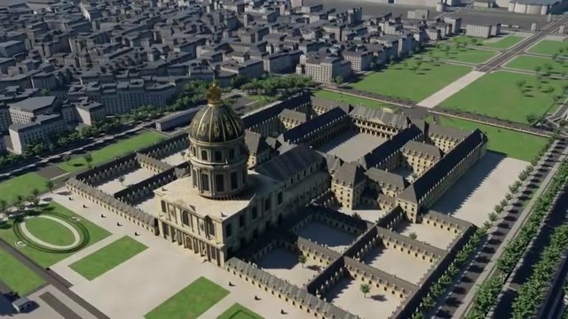</a> | **Les Invalides (Paris): Blender model, then an Unreal Engine fly-through** [Emmanuel Guillo](https://www.linkedin.com/posts/emmanuelguillo_i-asked-gpt-6-astra-to-recreate-les-invalides-activity-7502032139152982016-Z5rj), LinkedIn, 2026-09-05 Asked Astra to recreate Les Invalides in Blender and bring it into Unreal Engine for a short aerial video, plus 4K close-ups of the dome, its gold ornaments and the stonework. Rendered on a MacBook Air M3. Tools: Blender, Unreal Engine · Archived copy: [video, 6 s](https://frank-zy-dou.github.io/awesome-astra/assets/videos/m01-les-invalides-blender-unreal-emmanuel-guillo.mp4) |
| <a href="https://frank-zy-dou.github.io/awesome-astra/assets/videos/m09-residential-reconstruction-tomkrcha.mp4">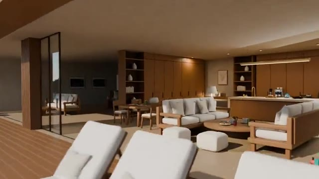</a> | **House photo to a full Blender reconstruction, furniture included** [Tom Krcha (@tomkrcha)](https://x.com/tomkrcha/status/2095598645190291775), X, 2026-09-03 Early-access test. One image of a house, with the request to build it in 3D "with all the details including toys, appliances and furniture". The author describes the result as a full Blender reconstruction with editable geometry that runs at 60 fps as a locally rendered walkthrough. Tools: Blender · Archived copy: [video, 20 s](https://frank-zy-dou.github.io/awesome-astra/assets/videos/m09-residential-reconstruction-tomkrcha.mp4) Follow-up: [Tom Krcha](https://www.linkedin.com/posts/tomkrcha_i-had-an-early-access-to-gpt-6-astra-and-activity-7501368431355707392-xm63) (LinkedIn, 2026-09-03): Original-author LinkedIn cross-post of the furnished-house Blender reconstruction and local walkthrough. Also shared by: [Emmanuel de Maistre](https://www.linkedin.com/posts/edemaistre_blendermania-activity-7501673226922659841-tfTP) (LinkedIn, 2026-09-04); [Ajay Y.](https://www.linkedin.com/posts/yadavajay_gpt-6-astra-vs-fable-51-in-blender-tom-activity-7501738418079576064-e9Ui) (LinkedIn, 2026-09-04); [Mike W.](https://www.linkedin.com/posts/mikesworley_gpt6astra-one-of-many-doing-the-rounds-activity-7501547177828106240-Viw0) (LinkedIn, 2026-09-04) |
| <a href="https://frank-zy-dou.github.io/awesome-astra/assets/videos/m10-manhattan-unreal-mattshumer.mp4">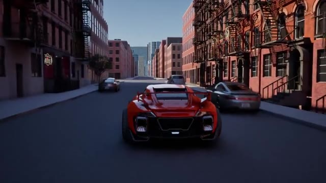</a> | **Manhattan built in Unreal Engine** [Matt Shumer (@mattshumer_)](https://x.com/mattshumer_/status/2095609734845927525), X, 2026-09-03 Author: "GPT-6 Astra built this Manhattan world in Unreal Engine over the course of a week. It was literally able to go street by street to make each one perfect." Tools: Unreal Engine · Archived copy: [video, 30 s](https://frank-zy-dou.github.io/awesome-astra/assets/videos/m10-manhattan-unreal-mattshumer.mp4) |
| <a href="https://frank-zy-dou.github.io/awesome-astra/assets/videos/m12-palace-of-fine-arts-sharifshameem.mp4">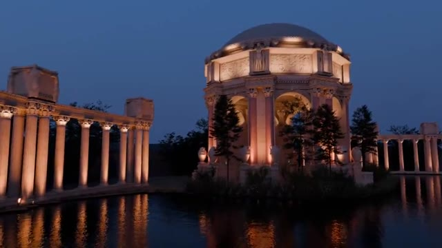</a> | **Palace of Fine Arts (San Francisco) recreated in Blender** [Sharif Shameem (@sharifshameem)](https://x.com/sharifshameem/status/2095653641164329143), X, 2026-09-03 Reconstruction of the San Francisco landmark in Blender; the clip shows the finished scene. Tools: Blender · Archived copy: [video, 30 s](https://frank-zy-dou.github.io/awesome-astra/assets/videos/m12-palace-of-fine-arts-sharifshameem.mp4) |
| <a href="https://frank-zy-dou.github.io/awesome-astra/assets/videos/m14-map-pin-to-3d-neighborhood-skirano.mp4">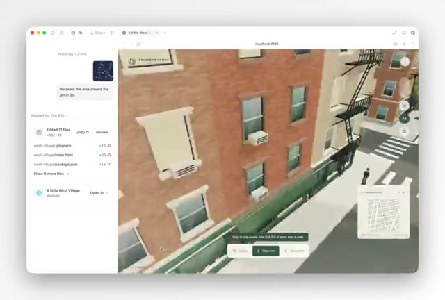</a> | **Drop a pin on a map, get the surrounding area in 3D** [Pietro Schirano (@skirano)](https://x.com/skirano/status/2095899479308144981), X, 2026-09-04 Author: "You can literally drop a pin on a map ask GPT-6 to recreate the area around it in 3D and it will just do that." Tools: not stated · Archived copy: [video, 43 s](https://frank-zy-dou.github.io/awesome-astra/assets/videos/m14-map-pin-to-3d-neighborhood-skirano.mp4) |
| <a href="https://frank-zy-dou.github.io/awesome-astra/assets/videos/m17-zillow-listing-house-realyunfanye.mp4">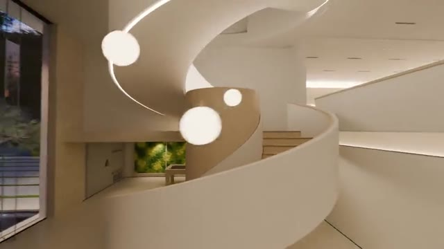</a> | **Zillow listing photos to a 3D house and a promo video** [Yunfan Ye (@realYunfanYe)](https://x.com/realYunfanYe/status/2095612137582526615), X, 2026-09-03 Given a Zillow listing, Astra modeled the house from the listing photos and produced a promotional video, "created in one shot". The author notes "there are still some wrong details". Tools: not stated · Archived copy: [video, 78 s](https://frank-zy-dou.github.io/awesome-astra/assets/videos/m17-zillow-listing-house-realyunfanye.mp4) |
| <a href="https://frank-zy-dou.github.io/awesome-astra/assets/videos/m18-villa-scene-comparison-karankendre.mp4">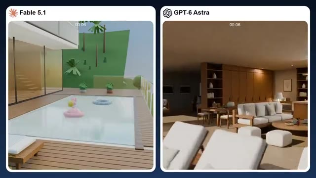</a> | **Villa scene in Blender, two models compared** [Karan (@karankendre)](https://x.com/karankendre/status/2095636679264780481), X, 2026-09-03 The same villa brief given to Fable 5.1 and GPT-6 Astra in Blender; the video shows what each built. Tools: Blender · Archived copy: [video, 20 s](https://frank-zy-dou.github.io/awesome-astra/assets/videos/m18-villa-scene-comparison-karankendre.mp4) |
| <a href="https://frank-zy-dou.github.io/awesome-astra/assets/videos/m11-house-blender-to-ue5-dimillian.mp4">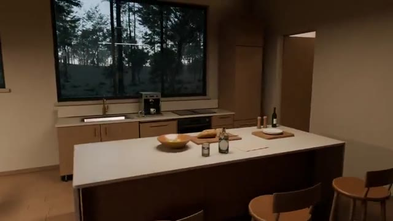</a> | **Demo house: Blender scene to a walkable Unreal Engine 5 level** [Thomas Ricouard (@Dimillian)](https://x.com/Dimillian/status/2095596700815516004), X, 2026-09-03 Walkthrough of how the demo house for OpenAI's launch blog post was built ("our launch blog post", in the author's words): from a Blender scene to a walkable Unreal Engine 5 experience. Tools: Blender, Unreal Engine 5 · Archived copy: [video, 30 s](https://frank-zy-dou.github.io/awesome-astra/assets/videos/m11-house-blender-to-ue5-dimillian.mp4) Follow-up: [Thomas Ricouard (@Dimillian)](https://x.com/Dimillian/status/2095596890691608693) (X, 2026-09-03): second pass to make the house more lived-in, with more props and adjusted lighting; "The coffee machine is even working now!" Also shared by: [Goofy (@goofyninjaaa)](https://x.com/goofyninjaaa/status/2095592572286533644) (X, 2026-09-03) |
| <a href="https://frank-zy-dou.github.io/awesome-astra/assets/videos/m32-kitchen-video-to-sim-assets-frankzydou.mp4">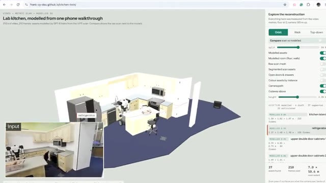</a> | **Lab kitchen walkthrough video to 3D assets with joints (kitchen-twin)** [Zhiyang (Frank) Dou (@frankzydou)](https://x.com/frankzydou/status/2098460193319186578), X, 2026-09-11 An agentic pipeline that turns one handheld phone walkthrough of a lab kitchen (~20 s) into 3D assets, with no depth sensor, CAD or asset library, in about a day including human-in-the-loop. The author's description of the loop: ViPE gives camera poses and metric depth; GPT-6 lists the objects, and open-vocabulary detection and tracking gives per-object masks; for every asset GPT-6 writes the object as a program in a small Blender DSL, renders it over the original frames, compares it with the scan points in 3D and iterates; a separate GPT-6 session is the verifier and "must justify every complaint with a frame"; the output is MJCF/URDF with joints. Author's caveats: "thin and shiny things are still weak, a few objects are drafts, the room shell needs another pass." Tools: ViPE, Blender (small DSL), MJCF/URDF · Archived copy: [video, 21 s](https://frank-zy-dou.github.io/awesome-astra/assets/videos/m32-kitchen-video-to-sim-assets-frankzydou.mp4) Links: [live scene (kitchen-twin)](https://frank-zy-dou.github.io/kitchen-twin/) |
| <a href="https://frank-zy-dou.github.io/awesome-astra/assets/videos/m36-basement-renovation-emmettshine.mp4">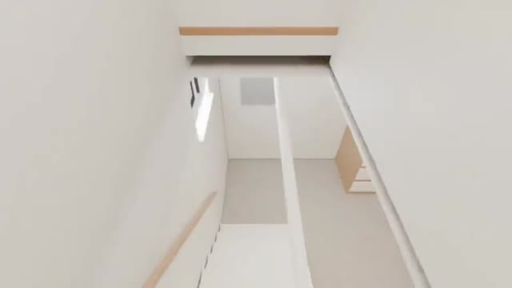</a> | **Basement renovation: contractor recording and photos to an interactive model** [Emmett (@emmettshine)](https://x.com/emmettshine/status/2100203274594836575), X, 2026-09-16 Emmett describes using "a @meetgranola recording with our contractor + four iPhone photos of our basement". The post credits "Astra GTP6" with an interactive renovation rendering and walkthrough, and links the result. Links: [project/source 1](https://basement.emmettshine.com) Tools: Granola; iPhone photos; rendering tools not stated · Archived copy: [video, 28 s](https://frank-zy-dou.github.io/awesome-astra/assets/videos/m36-basement-renovation-emmettshine.mp4) |
| <a href="https://frank-zy-dou.github.io/awesome-astra/assets/videos/m37-apartment-photo-tour-dylan-szeto.mp4">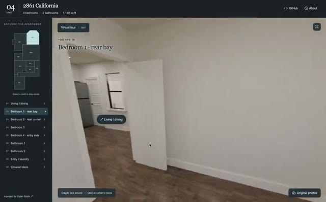</a> | **Apartment photos and a floor plan to a Blender tour** [Dylan Szeto (@dylan_szeto)](https://x.com/dylan_szeto/status/2099332206103794152), X, 2026-09-14 Dylan Szeto describes an apartment-reconstruction test with GPT-6 Astra. Author: "gave it 12 apartment photos, 1 floor plan, and access to Blender. it built this apartment tour." Tools: Blender · Archived copy: [video, 22 s](https://frank-zy-dou.github.io/awesome-astra/assets/videos/m37-apartment-photo-tour-dylan-szeto.mp4) |
| <a href="https://www.youtube.com/watch?v=-545TXdfrTQ">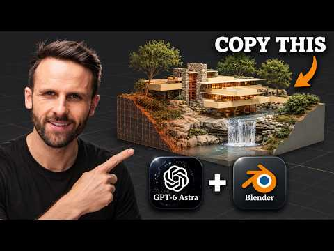</a> | **Fallingwater, a studio and a NEO robot: three Blender builds** [Pat Simmons](https://www.youtube.com/watch?v=-545TXdfrTQ), YouTube, 2026-09-09 Pat Simmons documents a Fallingwater reconstruction, his studio and a NEO robot model embedded in a webpage. His companion article reports "54 hours of unattended compute" and describes the costs as "API-equivalent costs"; it also records rendering, water, camera and performance defects. These are author-documented builds, including a visual robot model rather than robot control. Links: [project/source 1](https://www.aiformortals.co/blog/gpt-6-astra-blender-fallingwater) · [project/source 2](https://fallingwater-astra.vercel.app/) · [project/source 3](https://pat-studio-astra.vercel.app/) · [project/source 4](https://neo-astra-demo.vercel.app/) Tools: Blender; Python API; Blender MCP; custom blender-production skill · Archived copy: [thumbnail](assets/images/m42-three-blender-builds-pat-simmons.jpg) Links: [code on GitHub](https://github.com/per-simmons/blender-production) |
| <a href="https://frank-zy-dou.github.io/awesome-astra/assets/videos/m44-tesla-factory-adil-alimzhanov.mp4">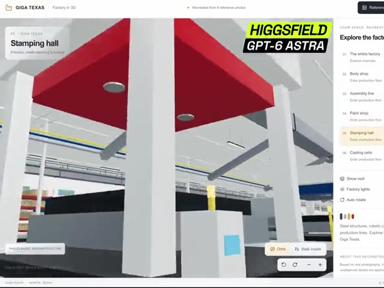</a> | **Tesla factory photos to an interactive 3D layout** [Adil Alimzhanov (@adilinthewild)](https://x.com/adilinthewild/status/2097767621794070704), X, 2026-09-09 Adil Alimzhanov writes "Sent 9 photos of a Tesla factory to GPT-6 Astra". He describes an explorable factory model and attaches a photograph collage and a video; no layout accuracy measurement is stated. Tools: No modeling tool named · Archived copy: [video, 15 s](https://frank-zy-dou.github.io/awesome-astra/assets/videos/m44-tesla-factory-adil-alimzhanov.mp4) · [image](assets/images/m44-tesla-factory-adil-alimzhanov-p1.jpg) |
| <a href="https://frank-zy-dou.github.io/awesome-astra/assets/videos/m48-stanford-kitchen-linfeng-zhao.mp4">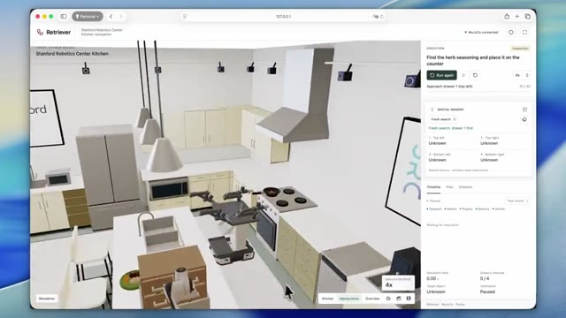</a> | **Stanford kitchen video to a MuJoCo scene with movable drawers** [Linfeng Zhao (@LinfengZhaoZLF)](https://x.com/LinfengZhaoZLF/status/2097740382511800768), X, 2026-09-09 Linfeng Zhao describes a Stanford Robotics Center kitchen reconstructed from a phone video using GPT-6 Astra. Author: "The physics is running in Mujoco and then rendered to the interactive webpage." The post also describes clickable drawers and a mobile ALOHA model in the scene. Links: [project/source 1](http://retriever.systems) Tools: Codex; MuJoCo; Retriever; mobile ALOHA · Archived copy: [video, 81 s](https://frank-zy-dou.github.io/awesome-astra/assets/videos/m48-stanford-kitchen-linfeng-zhao.mp4) Links: [code on GitHub](https://github.com/openretriever/retriever) |
| <a href="https://frank-zy-dou.github.io/awesome-astra/assets/videos/m50-studio-photos-roberto-nickson.mp4">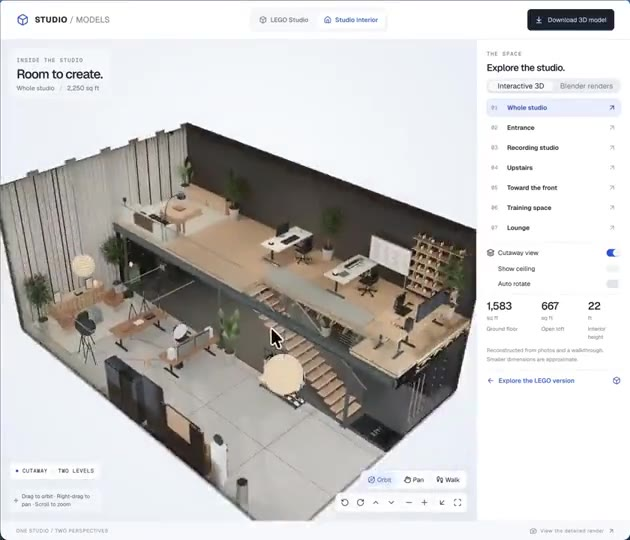</a> | **Studio photographs to an interactive 3D room** [Roberto Nickson (@rpnickson)](https://x.com/rpnickson/status/2097488440489116111), X, 2026-09-09 Roberto Nickson describes providing "9 crappy photos of my studio" to GPT-6 Astra. He reports a "fully interactive 3D model of the space"; a photo collage, video and creator-owned scene accompany the claim. Links: [project/source 1](https://studio-in-bricks.rpn24.chatgpt.site/interior) Tools: No modeling tool named · Archived copy: [video, 18 s](https://frank-zy-dou.github.io/awesome-astra/assets/videos/m50-studio-photos-roberto-nickson.mp4) · [image](assets/images/m50-studio-photos-roberto-nickson-p1.jpg) |
| &nbsp; | **Gentle Monster-inspired retail-store concept in Blender** [Claire Xue](https://www.linkedin.com/posts/claire-xue-style_gpt-6-astra-activity-7502882992957210625-qsGQ), LinkedIn, 2026-09-08 Claire Xue describes giving Astra a visual reference for a Gentle Monster-inspired San Francisco store concept in Blender. The author says "we had a 3D scene we could continue shaping ourselves" and notes that cleanup and creative direction remain; the attached document includes scene imagery. Tools: Blender; Codex in the attached document |
| <a href="https://frank-zy-dou.github.io/awesome-astra/assets/videos/m58-architectural-walkthrough-shahad-hussain.mp4">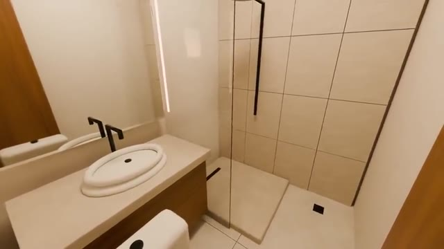</a> | **Editable architectural walkthrough with directed camera movements** [Shahad Hussain](https://www.linkedin.com/posts/shahadhussain1897_gptastra-blender-spatialintelligence-activity-7502837251924467712-aCZ9), LinkedIn, 2026-09-07 Shahad Hussain presents a GPT Astra/Blender walkthrough based on a prompt and reference images. The author describes "An actual, editable 3D environment" and notes "There were still corrections and visual checks along the way." Tools: Blender · Archived copy: [video, 120 s](https://frank-zy-dou.github.io/awesome-astra/assets/videos/m58-architectural-walkthrough-shahad-hussain.mp4) |
| <a href="https://www.youtube.com/watch?v=A4BUbpKdenc">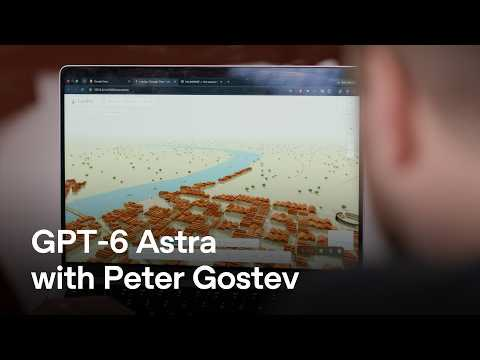</a> | **London through historical eras: Peter Gostev's 3D scene** [OpenAI](https://www.youtube.com/watch?v=A4BUbpKdenc), YouTube, 2026-09-06 OpenAI's creator showcase describes Peter Gostev "building a 3D London that moves through different historical eras". The original thumbnail shows the city scene on a laptop; no tool, accuracy measurement or build duration is stated for that scene. Tools: No London-scene tools named · Archived copy: [thumbnail](assets/images/m62-historical-london-peter-gostev.jpg) |
| <a href="https://frank-zy-dou.github.io/awesome-astra/assets/videos/m66-street-reconstruction-yokohara.mp4">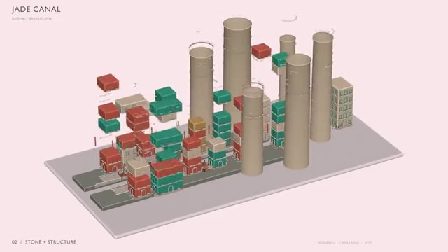</a> | **Reference-image street scene and breakdown in Blender** [Hirokazu Yokohara (@Yokohara_h)](https://x.com/Yokohara_h/status/2096622171011666003), X, 2026-09-06 Hirokazu Yokohara gives GPT-6 Astra an image for a Blender street-scene reconstruction and an edited breakdown. The author cautions "完成度はまだまだ駄目" (the quality is still not good enough), despite seeing this as a change in 3D production. Tools: Blender · Archived copy: [video, 22 s](https://frank-zy-dou.github.io/awesome-astra/assets/videos/m66-street-reconstruction-yokohara.mp4) |
| <a href="https://frank-zy-dou.github.io/awesome-astra/assets/videos/m73-drawing-room-scan-bilawal-sidhu.mp4">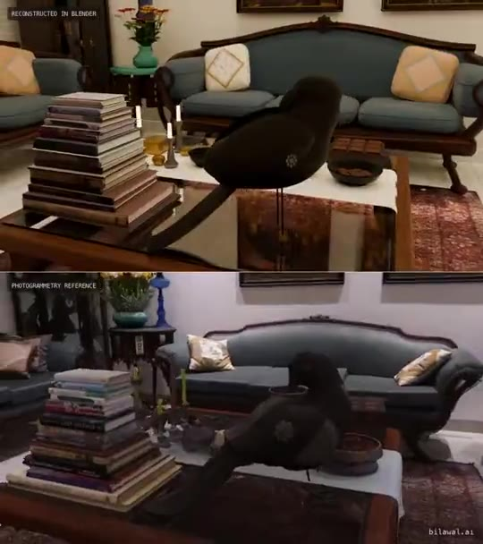</a> | **Drawing-room photogrammetry scan rebuilt in Blender** [Bilawal Sidhu (@bilawalsidhu)](https://x.com/bilawalsidhu/status/2096092080397246707), X, 2026-09-05 Bilawal Sidhu asks GPT-6 Astra to rebuild his parents' drawing room from an old scan. The author says it "sourced textures from my photogrammetry scan and make procedural shaders"; the post includes a comparison clip. Tools: Blender; photogrammetry scan; procedural shaders · Archived copy: [video, 30 s](https://frank-zy-dou.github.io/awesome-astra/assets/videos/m73-drawing-room-scan-bilawal-sidhu.mp4) |
| <a href="https://frank-zy-dou.github.io/awesome-astra/assets/videos/m74-piata-unirii-voxel-dan-manastireanu.mp4">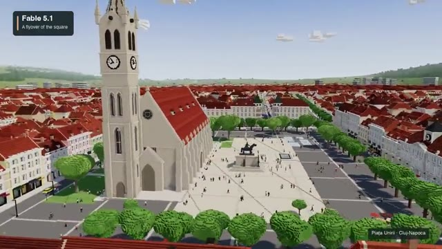</a> | **Piața Unirii voxel worlds: Astra and Fable compared** [Dan Manastireanu (@danmana)](https://x.com/danmana/status/2096262733259837681), X, 2026-09-05 Dan Manastireanu compares models using "Same prompt, two interactive voxel worlds of Piața Unirii in Cluj-Napoca." His verdict is "Initial results look good, but not quite Fable level." Links: [project/source 1](https://piata-unirii.vercel.app/runs/gpt-astra-xhigh-01/index.html) Tools: Astra; Fable 5.1; browser voxel worlds · Archived copy: [video, 24 s](https://frank-zy-dou.github.io/awesome-astra/assets/videos/m74-piata-unirii-voxel-dan-manastireanu.mp4) |
| <a href="https://frank-zy-dou.github.io/awesome-astra/assets/videos/m77-warsaw-pkin-pawel-manowiecki.mp4">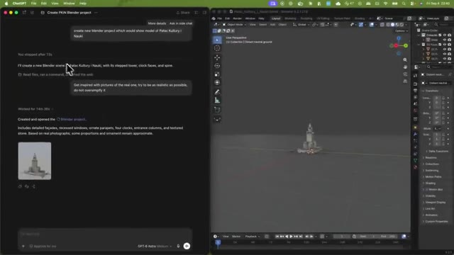</a> | **Warsaw's Palace of Culture and Science from photographs and Python** [Pawel Manowiecki](https://www.linkedin.com/posts/manowiecki_astra-3d-codex-activity-7501750848708952064-oh0q), LinkedIn, 2026-09-04 Pawel Manowiecki tests GPT 6 Astra on Warsaw's PKiN building from photographs. He says "It wrote zero-shot Python code to generate it" and describes a later iteration using more pictures; the post explicitly rules out Blender MCP and GUI clicking for this run. Tools: Codex; Blender; Python · Archived copy: [video, 78 s](https://frank-zy-dou.github.io/awesome-astra/assets/videos/m77-warsaw-pkin-pawel-manowiecki.mp4) |

### Vehicles, products and environments

| Preview | Case |
|---|---|
| <a href="https://frank-zy-dou.github.io/awesome-astra/assets/videos/m07-steam-locomotive-sketch-tomkrcha.mp4">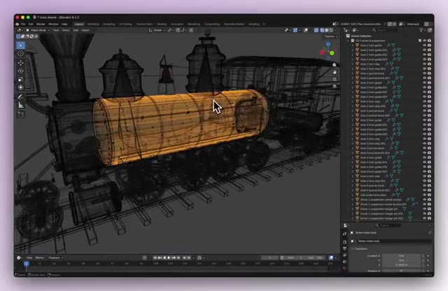</a> | **Steam-locomotive drawing to an editable Blender model** [Tom Krcha (@tomkrcha)](https://x.com/tomkrcha/status/2095756085890310311), X, 2026-09-04 An old drawing of a steam train, given to Astra to reconstruct in Blender. Author: "After few minutes it crafted 3,295 fully editable detailed objects with beautiful geometry." Level of detail can be requested. Tools: Blender · Archived copy: [video, 34 s](https://frank-zy-dou.github.io/awesome-astra/assets/videos/m07-steam-locomotive-sketch-tomkrcha.mp4) Follow-up: [Tom Krcha (@tomkrcha)](https://x.com/tomkrcha/status/2096268323898167556) (X, 2026-09-05): Geometry-construction explanation: Python code builds the locomotive, rather than manual per-part GUI modeling. Follow-up: [Tom Krcha (@tomkrcha)](https://x.com/tomkrcha/status/2095758998708662535) (X, 2026-09-04): Tool-interface clarification: primarily MCP, with occasional computer-use checks. Also shared by: [Dr. Ajy Sharma](https://www.linkedin.com/posts/drrajayksharma_ai-aiagents-blender-activity-7502390805286940672-8eVO) (LinkedIn, 2026-09-06) |
| <a href="https://frank-zy-dou.github.io/awesome-astra/assets/videos/m08-tugboat-concept-to-blender-de-maistre.mp4">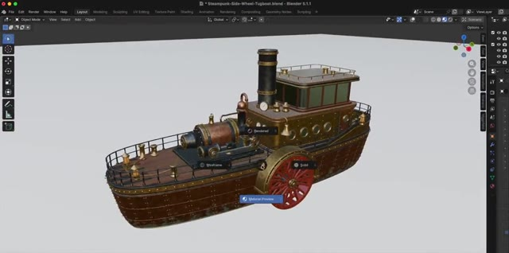</a> | **Tugboat concept art to a Blender model in about 10 minutes** [Emmanuel de Maistre](https://www.linkedin.com/posts/edemaistre_whats-happening-now-is-totally-surreal-activity-7501892042940375040-_TZr), LinkedIn, 2026-09-05 · reshared by [Shawn Woods](https://www.linkedin.com/posts/shawnwoods_gpt-6-astra-building-a-3d-model-directly-activity-7502009116899299329-DxnY), LinkedIn, 2026-09-05 Author: "GPT 6 built this studio-quality tugboat in @Blender from one Scenario image and one prompt, in about 10 min. Fully autonomous." A low-poly version "under 10k faces" followed "in 10 more minutes". Shawn Woods, sharing it: "There's a ways to go before they hit the quality of an artist." Tools: Blender · Archived copy: [video, 46 s](https://frank-zy-dou.github.io/awesome-astra/assets/videos/m08-tugboat-concept-to-blender-de-maistre.mp4) |
| <a href="https://frank-zy-dou.github.io/awesome-astra/assets/videos/m03-miomoto-phone-model-aharon-shiker.mp4">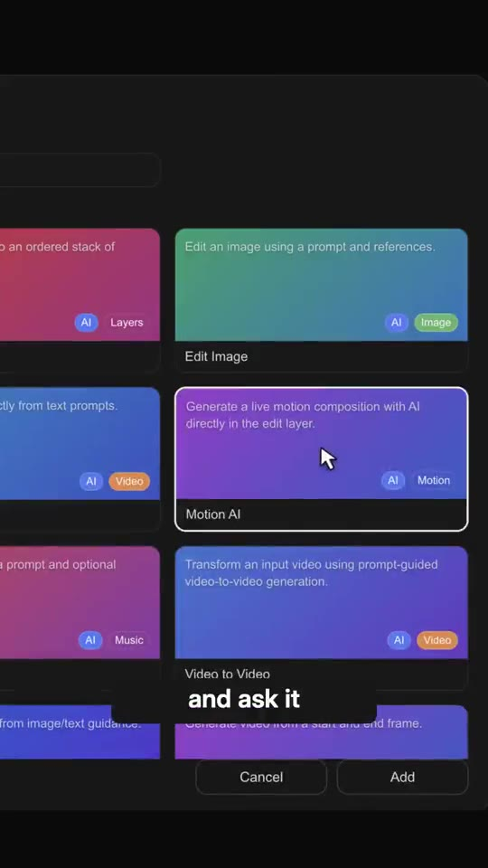</a> | **Phone model and motion graphics built inside Miomoto** [Aharon Shiker](https://www.linkedin.com/posts/aharon-shiker-960943227_miomoto-the-new-gpt-astra-is-next-level-activity-7501954220506497024-61Ca), LinkedIn, 2026-09-05 Miomoto's Motion AI paired with GPT Astra: 3D models, scenes and motion graphics built on the timeline from a prompt. Author's pipeline: "Prompt → build the scene → refine → video-to-video → final shot." Tools: Miomoto · Archived copy: [video, 14 s](https://frank-zy-dou.github.io/awesome-astra/assets/videos/m03-miomoto-phone-model-aharon-shiker.mp4) |
|  | **Ship modeled from scratch in Blender and rendered in 4K** [Ben Davis (@davis7)](https://x.com/davis7/status/2095600857626923097), X, 2026-09-03 The attached clip is "a full 4k render of a ship that it made from scratch in blender". The same post reports Astra doing project setup and color grades in Final Cut Pro and selections in Affinity Photo through computer use. Tools: Blender, Final Cut Pro, Affinity Photo · Archived copy: [video, 7 s](https://frank-zy-dou.github.io/awesome-astra/assets/videos/m31-blender-boat-render-davis7.mp4) |
| <a href="https://www.linkedin.com/posts/sunewolff_enterprisexr-generativeai-3d-activity-7504044818801553408-QTQU">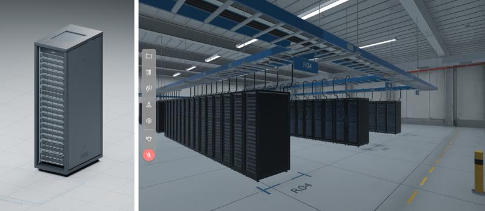</a> | **Server rack and data center: Blender to Unity to SynergyXR** [Sune Wolff](https://www.linkedin.com/posts/sunewolff_enterprisexr-generativeai-3d-activity-7504044818801553408-QTQU), LinkedIn, 2026-09-11 Pipeline as described by the author: a server rack modeled in Blender from four reference photos; a data center from a single photo; 180 racks placed automatically in Blender; the FBX imported into Unity and built into a SynergyXR environment. "No MCP servers, no plugins, no connections, and Astra never touched our computer directly." Weak spot noted: reference adherence on the first blockout. Tools: Blender, Unity, SynergyXR · Archived copy: [image](assets/images/m05-server-rack-data-center-sune-wolff.jpg) Also shared by: [Linsey Horberry](https://www.linkedin.com/posts/linsey-horberry-76206325_astra-is-changing-the-game-for-3d-model-creation-activity-7504060619059523584-VbW-) (LinkedIn, 2026-09-11) |
| <a href="https://frank-zy-dou.github.io/awesome-astra/assets/videos/m35-lakeside-french-village-givros.mp4">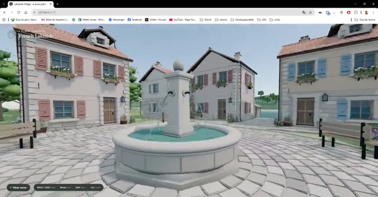</a> | **Lakeside French village with a circular central square** [Givros (@givros)](https://x.com/givros/status/2100292951356440961), X, 2026-09-16 Givros asks GPT-6 Astra Ultra for "a circular central square inside a roughly square village". The post describes a Codex-and-Blender workflow spanning layout, assets, rendering and visual inspection, with a video of the scene. Its requested checks are part of the brief, not independent proof that every geometric constraint was met. Tools: Codex; Blender; custom workflow · Archived copy: [video, 48 s](https://frank-zy-dou.github.io/awesome-astra/assets/videos/m35-lakeside-french-village-givros.mp4) |
| <a href="https://frank-zy-dou.github.io/awesome-astra/assets/videos/m43-reference-environment-gokula-krishnan.mp4">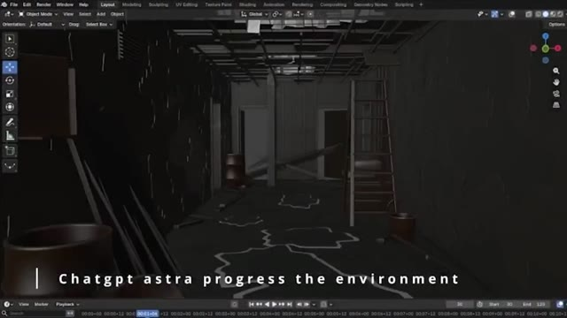</a> | **Reference-guided Blender environment and cinematic** [Gokula Krishnan P](https://www.linkedin.com/posts/gokula-krishnan-p-14b738173_blender-ai-3d-activity-7503325196985139200-tNNq), LinkedIn, 2026-09-09 Gokula Krishnan P describes recreating an environment in Blender with ChatGPT Astra, including reference, composition, materials and details. The author calls the result "a complete 3D environment + cinematic video", and attaches the clip. Tools: Blender; ChatGPT Astra · Archived copy: [video, 15 s](https://frank-zy-dou.github.io/awesome-astra/assets/videos/m43-reference-environment-gokula-krishnan.mp4) |
| <a href="https://frank-zy-dou.github.io/awesome-astra/assets/videos/m45-shoe-last-animation-flora.mp4">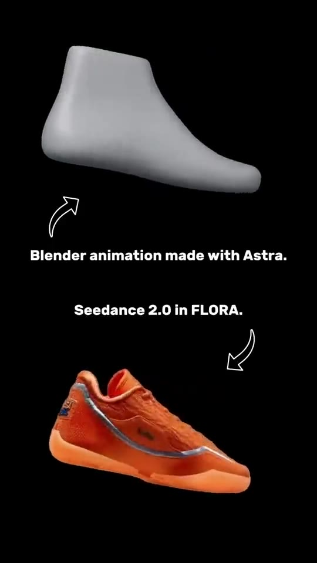</a> | **Shoe-last animation in Blender used to guide FLORA video** [FLORA © (@floraai)](https://x.com/floraai/status/2097763728217272598), X, 2026-09-09 FLORA describes a workflow in which "Astra opens Blender, builds a 3D model of a Shoe Last, and animates it first". The resulting animation is used to guide the later FLORA video; the attached clip distinguishes the Blender motion from the generated shoe imagery. Tools: Blender; FLORA · Archived copy: [video, 6 s](https://frank-zy-dou.github.io/awesome-astra/assets/videos/m45-shoe-last-animation-flora.mp4) |
| <a href="https://x.com/_nscr/status/2097744564073218443">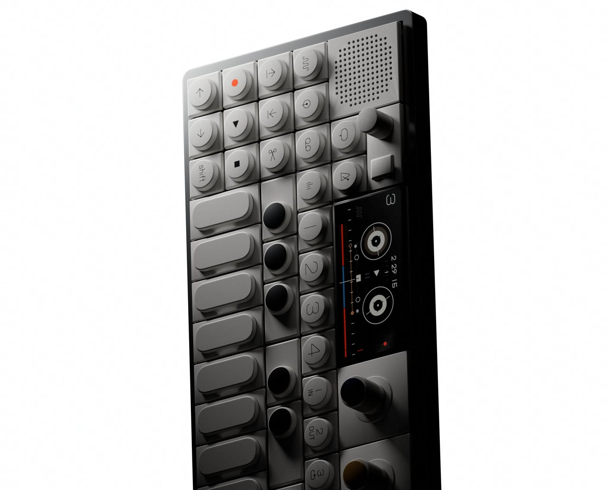</a> | **OP-1 Field modeled and rendered in Houdini through MCP** [Nick Scarcella (@_nscr)](https://x.com/_nscr/status/2097744564073218443), X, 2026-09-09 Nick Scarcella says he "Had GPT-6 Astra model and render an OP-1 Field in Houdini via MCP." The post includes the product render and explicitly cautions "There's issues". Tools: Houdini; MCP · Archived copy: [image](assets/images/m49-op1-field-houdini-nick-scarcella.jpg) |
| <a href="https://frank-zy-dou.github.io/awesome-astra/assets/videos/m52-procedural-houdini-yokohara.mp4">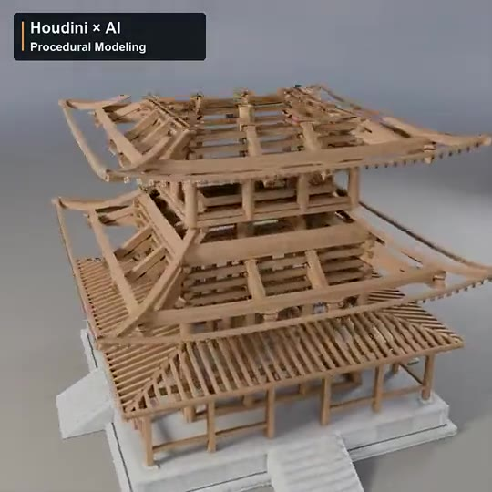</a> | **Procedural architectural modeling and animation in Houdini** [Hirokazu Yokohara (@Yokohara_h)](https://x.com/Yokohara_h/status/2097666997719089337), X, 2026-09-09 Hirokazu Yokohara tests GPT-6 Astra on procedural modeling in Houdini, with lighting and video included in the instructions. The author notes "修正指示は何回もしないといけない" (repeated correction instructions are needed); the attached clip shows the modeling result. Tools: Houdini · Archived copy: [video, 30 s](https://frank-zy-dou.github.io/awesome-astra/assets/videos/m52-procedural-houdini-yokohara.mp4) |
| <a href="https://frank-zy-dou.github.io/awesome-astra/assets/videos/m53-porsche-subdivision-tomkrcha.mp4">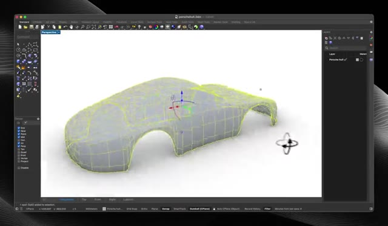</a> | **Porsche body: expert-guided subdivision topology** [Tom Krcha](https://www.linkedin.com/posts/tomkrcha_porsche911turbos-astra-activity-7503472486777454593-wdN2), LinkedIn, 2026-09-09 Tom Krcha tests GPT-6 Astra on a Porsche body and asks whether it can model clean subdivision topology and soft shapes. His conclusion is "Naive prompts will fail, refined systematic prompts written by an expert succeed." Tools: Subdivision-surface modeling; Blender visible in media · Archived copy: [video, 13 s](https://frank-zy-dou.github.io/awesome-astra/assets/videos/m53-porsche-subdivision-tomkrcha.mp4) |
| <a href="https://frank-zy-dou.github.io/awesome-astra/assets/videos/m54-cozy-wetland-lake-givros.mp4">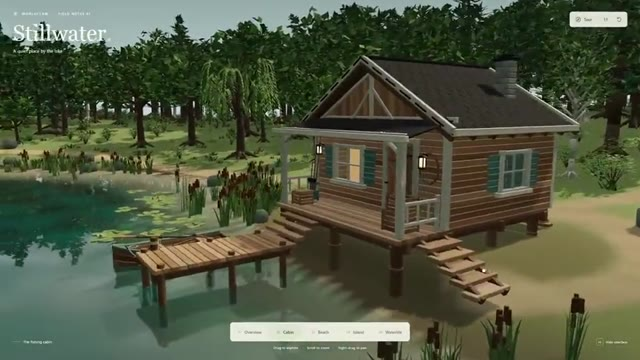</a> | **Cozy wetland lake: Blender assets to a Three.js world** [Givros (@givros)](https://x.com/givros/status/2097343467026289039), X, 2026-09-08 Givros presents a GPT-6 Astra lake scene from a prompt beginning "Create a cozy lake with a fisherman's cabin on the marshy shore." The post describes expanding that brief into a production prompt spanning Blender assets, GLB export, Three.js assembly, animation, controls and visual checks. Links: [project/source 1](https://givros.github.io/cozylake/) Tools: Blender; GLB; Three.js; custom prompting workflow · Archived copy: [video, 63 s](https://frank-zy-dou.github.io/awesome-astra/assets/videos/m54-cozy-wetland-lake-givros.mp4) |
| &nbsp; | **Kitchen assets, materials and lighting in Blender** [AKANSHA DEVLI](https://www.linkedin.com/posts/akansha-devli-38253a325_astra-ai-blender-activity-7503010571693293571-2sm-), LinkedIn, 2026-09-08 AKANSHA DEVLI presents an ASTRA-and-Blender kitchen-scene experiment. The author describes "3D asset generation from a simple prompt" and "Scene integration into a complete kitchen environment", with an attached process image. Tools: Blender |
| <a href="https://frank-zy-dou.github.io/awesome-astra/assets/videos/m59-forest-path-comparison-satyam-kumar.mp4">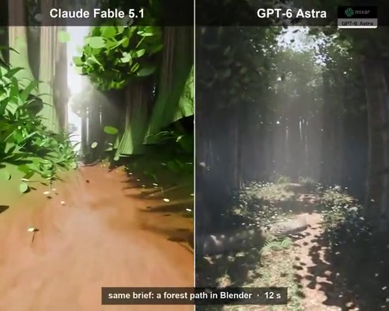</a> | **Forest path in Blender: Astra and Fable compared** [Satyam Kumar (@_satyam_ai)](https://x.com/_satyam_ai/status/2096918350941266415), X, 2026-09-07 Satyam Kumar compares the two models on "Same brief: a forest path in Blender, 12 seconds each." The attached side-by-side clip is the task evidence; the author's proposed explanation about training data is speculation rather than a measured finding. Tools: Blender; Claude Fable 5.1; GPT-6 Astra · Archived copy: [video, 12 s](https://frank-zy-dou.github.io/awesome-astra/assets/videos/m59-forest-path-comparison-satyam-kumar.mp4) |
| <a href="https://frank-zy-dou.github.io/awesome-astra/assets/videos/m61-bottle-model-dara.mp4">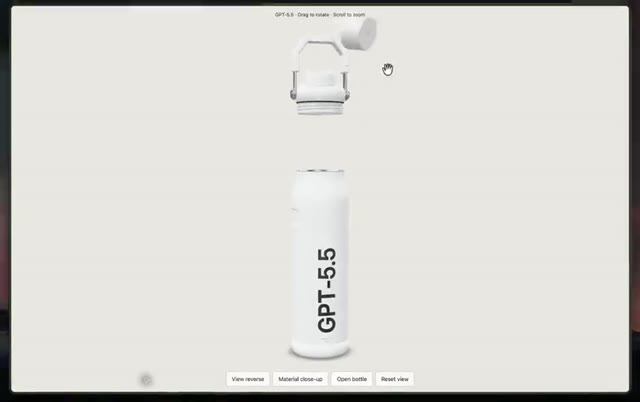</a> | **A personal bottle recreated as a 3D model** [Dara A. (@daradoescode)](https://x.com/daradoescode/status/2097111589002350688), X, 2026-09-07 Dara A. describes Astra making personal objects into "3d models". This post's object is "my LIMITED edition goblin bottle", shown in the attached model video. Tools: No tool named · Archived copy: [video, 16 s](https://frank-zy-dou.github.io/awesome-astra/assets/videos/m61-bottle-model-dara.mp4) |
| <a href="https://frank-zy-dou.github.io/awesome-astra/assets/videos/m63-gpu-workstation-alexey-fateev.mp4">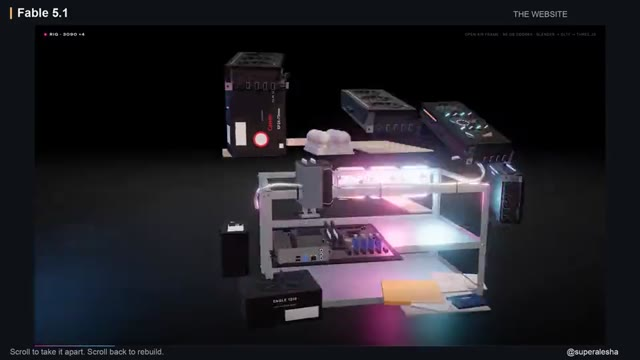</a> | **GPU workstation photographs to Blender models and animated websites** [Alexey Fateev (@superalesha)](https://x.com/superalesha/status/2096706133121540436), X, 2026-09-06 Alexey Fateev gives both models "four photos of my 4x3090 rig from different angles and access to Blender MCP." After reconstruction, he asks each for an animated website and attaches the comparison. Tools: Blender MCP; GPT-6 Astra; Fable 5.1 · Archived copy: [video, 45 s](https://frank-zy-dou.github.io/awesome-astra/assets/videos/m63-gpu-workstation-alexey-fateev.mp4) |
| <a href="https://frank-zy-dou.github.io/awesome-astra/assets/videos/m64-radial-engine-techartist.mp4">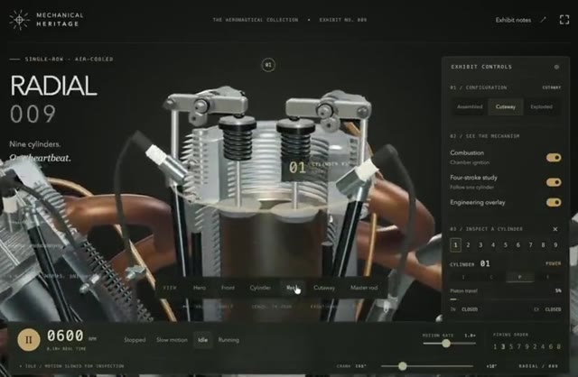</a> | **Interactive radial-engine model in a browser** [Techartist (@techartist_)](https://x.com/techartist_/status/2096577974242033738), X, 2026-09-06 Techartist presents an interactive engine model and explicitly credits "Code -> GPT-6 Astra". The author describes the subject as "The 9-cylinder radial engine"; the attached clip shows the browser visualization. Tools: Browser-based code; no library named · Archived copy: [video, 22 s](https://frank-zy-dou.github.io/awesome-astra/assets/videos/m64-radial-engine-techartist.mp4) |
| <a href="https://x.com/waitin4agi_/status/2096572429066006845">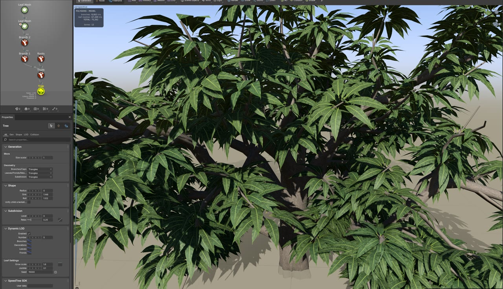</a> | **Indian mango tree and materials in SpeedTree** [Varun Mayya (@waitin4agi_)](https://x.com/waitin4agi_/status/2096572429066006845), X, 2026-09-06 Varun Mayya tests Astra on SpeedTree, requesting an Indian mango tree. He reports generated leaf and bark materials but cautions "Bark material could've been better"; the requested Unreal quality/frame-rate target is not a measured result. Tools: SpeedTree; Unreal named in the requested target · Archived copy: [image 1](assets/images/m65-mango-tree-speedtree-varun-mayya-1.jpg) · [image 2](assets/images/m65-mango-tree-speedtree-varun-mayya-2.jpg) · [image 3](assets/images/m65-mango-tree-speedtree-varun-mayya-3.jpg) |
| <a href="https://frank-zy-dou.github.io/awesome-astra/assets/videos/m71-anatomy-model-ashe.mp4">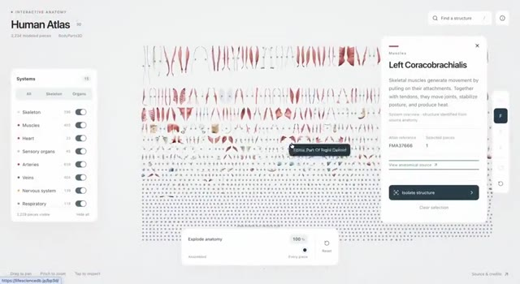</a> | **An explorable male-anatomy model with separated parts** [ashe (@ashebytes)](https://x.com/ashebytes/status/2096221988763173186), X, 2026-09-05 ashe presents a GPT-6 Astra anatomy website. The author says it "pulls apart the male anatomy into 2,234 modeled pieces"; the post does not provide an independent part-count or anatomical-accuracy check. Tools: 3D website; no library named · Archived copy: [video, 39 s](https://frank-zy-dou.github.io/awesome-astra/assets/videos/m71-anatomy-model-ashe.mp4) |
| <a href="https://x.com/mojon1/status/2096189580752081024">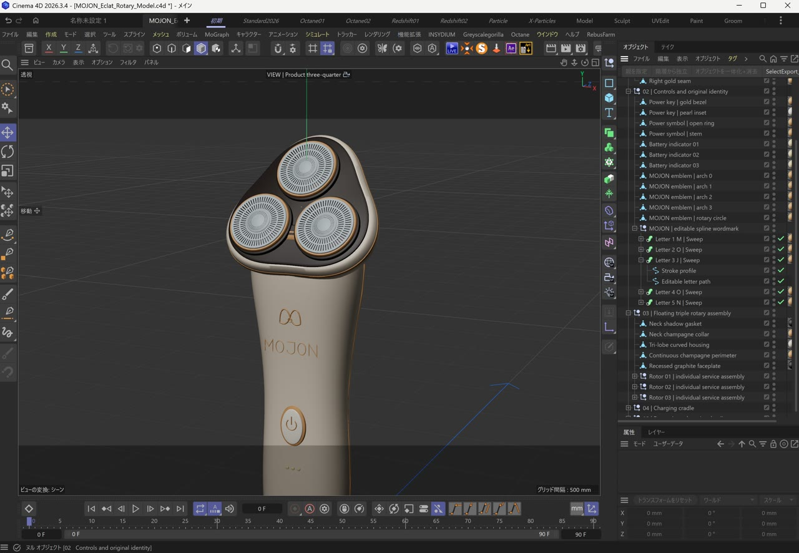</a> | **Electric-shaver modeling in Cinema4D with subdivision surfaces** [モジョン (@mojon1)](https://x.com/mojon1/status/2096189580752081024), X, 2026-09-05 The author tests whether Astra can model in Cinema4D and attaches images of an electric shaver. The modeling explanation is "ボディはSDSだし細いラインはスイープオブジェクト。" (the body uses SDS and the thin lines use sweep objects). Tools: Cinema4D; SDS; sweep objects · Archived copy: [image 1](assets/images/m72-cinema4d-shaver-mojon1-1.jpg) · [image 2](assets/images/m72-cinema4d-shaver-mojon1-2.jpg) |
| <a href="https://frank-zy-dou.github.io/awesome-astra/assets/videos/m75-v8-engine-dilum-sanjaya.mp4">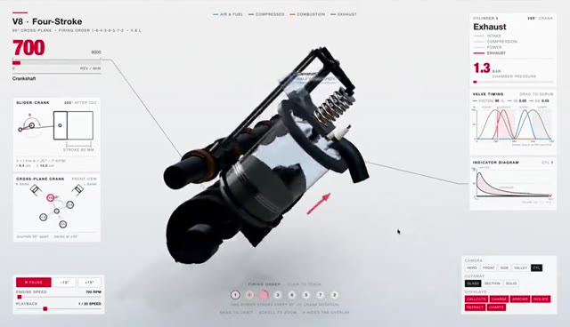</a> | **Interactive V8-engine visualization** [Dilum Sanjaya (@DilumSanjaya)](https://x.com/DilumSanjaya/status/2096280244663775423), X, 2026-09-05 Dilum Sanjaya writes "Asked GPT-6 Astra to create a highly detailed, interactive visualization of a V8 engine". The attached video is the visualization evidence; no physical-engine or accuracy test is reported. Tools: No modeling tool or library named · Archived copy: [video, 52 s](https://frank-zy-dou.github.io/awesome-astra/assets/videos/m75-v8-engine-dilum-sanjaya.mp4) |
| <a href="https://frank-zy-dou.github.io/awesome-astra/assets/videos/m78-titan-visualization-arda-tugsat.mp4">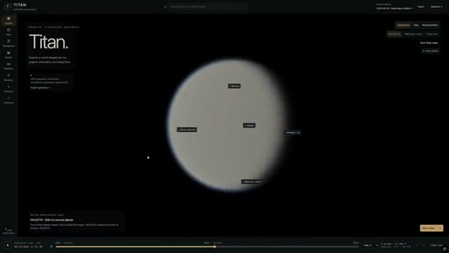</a> | **Titan visualization with Astra Medium in Codex** [Arda Tuğsat (@ArdaTugsat)](https://x.com/ArdaTugsat/status/2095986941753712841), X, 2026-09-04 Arda Tuğsat presents "Scientific 3D simulation of the Saturn's largest moon Titan". The caption credits "GPT-6 Astra Medium Reasoning in Codex"; scientific accuracy is not independently evaluated. Tools: Codex; GPT-6 Astra Medium · Archived copy: [video, 331 s](https://frank-zy-dou.github.io/awesome-astra/assets/videos/m78-titan-visualization-arda-tugsat.mp4) |

### Characters, rigging and animation

| Preview | Case |
|---|---|
| <a href="https://frank-zy-dou.github.io/awesome-astra/assets/videos/m16-werewolf-character-rig-mreflow.mp4">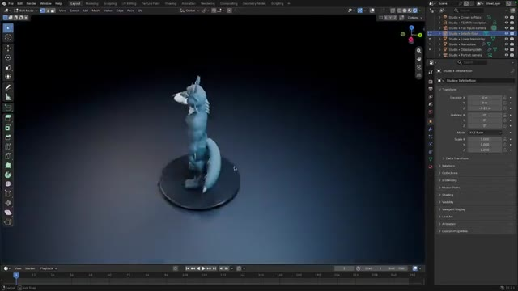</a> | **Humanoid wolf modeled in Blender through computer use** [Matt Wolfe (@mreflow)](https://x.com/mreflow/status/2095601201958309895), X, 2026-09-03 Early-access test. Author: "I asked it to make me a humanoid wolf in Blender, it used computer use, took control of Blender, and made the wolf in 8-minutes." The post also covers a game clone and a web simulator built in the same session. Tools: Blender · Archived copy: [video, 87 s](https://frank-zy-dou.github.io/awesome-astra/assets/videos/m16-werewolf-character-rig-mreflow.mp4) |
| <a href="https://x.com/Dr_pepperien/status/2096599023901872590">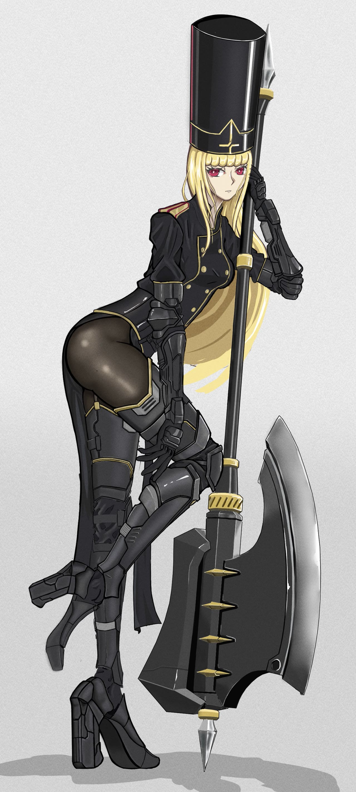</a> | **Original character from model sheets: a modeler's verdict** [レオン (@Dr_pepperien)](https://x.com/Dr_pepperien/status/2096599023901872590), X, 2026-09-06 The author's own character design, with model sheets and three-view drawings of the weapon, given to Astra to model. Verdict (in Japanese): a modeler will not be out of a job yet. Two images: the reference material and the result. Tools: not stated · Archived copy: [image 1](assets/images/m15-character-turntable-test-dr-pepperien-1.jpg) · [image 2](assets/images/m15-character-turntable-test-dr-pepperien-2.jpg) |
| <a href="https://frank-zy-dou.github.io/awesome-astra/assets/videos/m21-rigging-helper-workflow-dstudio-ai.mp4">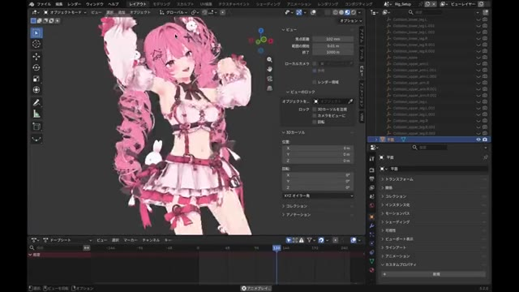</a> | **Tripo model rigged in Blender with a custom rigging helper** [Nano(ナノ) (@Dstudio_ai)](https://x.com/Dstudio_ai/status/2096475126942560677), X, 2026-09-06 Character generated in Tripo as three parts (hair, head, body), then joined and rigged in Blender by Astra, using a rigging-helper app the author wrote for it; secondary motion was set up as well. Caveats from the author: heavy Astra token and Tripo credit consumption, and some Blender knowledge still required. Finished in under half a day, mostly unattended. Tools: Tripo, Blender · Archived copy: [video, 50 s](https://frank-zy-dou.github.io/awesome-astra/assets/videos/m21-rigging-helper-workflow-dstudio-ai.mp4) |
| <a href="https://frank-zy-dou.github.io/awesome-astra/assets/videos/m22-auto-rigging-motion-thebuggeddev.mp4">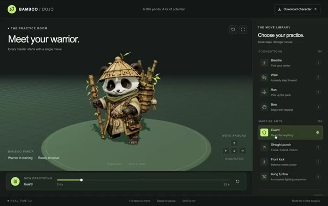</a> | **Auto-rigging and animation of an existing model** [The Bugged Dev (@thebuggeddev)](https://x.com/thebuggeddev/status/2096141728487178503), X, 2026-09-05 A 3D model (a panda warrior the author had made in Tripo) handed to Astra with the request to auto-rig it and add walking, running and kung-fu animations. The author reports it took three sessions and "somewhere it is still very much broken", but was better than a Kimi K3 attempt on the same model. Tools: not stated · Archived copy: [video, 30 s](https://frank-zy-dou.github.io/awesome-astra/assets/videos/m22-auto-rigging-motion-thebuggeddev.mp4) |
| <a href="https://frank-zy-dou.github.io/awesome-astra/assets/videos/m46-cartoon-character-controls-higgsfield.mp4">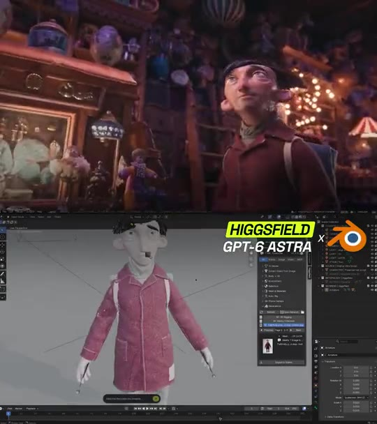</a> | **A poseable cartoon character in Higgsfield and Blender** [Higgsfield AI 🧩 (@higgsfield_ai)](https://x.com/higgsfield_ai/status/2097797358847430956), X, 2026-09-09 Higgsfield says "We asked GPT-6 Astra to make a cartoon. It handed us the controls." The post describes "A 3D character we can pose and animate, down to the fingers" and attaches a demonstration. Tools: Higgsfield; Blender · Archived copy: [video, 74 s](https://frank-zy-dou.github.io/awesome-astra/assets/videos/m46-cartoon-character-controls-higgsfield.mp4) |
| <a href="https://frank-zy-dou.github.io/awesome-astra/assets/videos/m47-articulated-avatar-yuntian-deng.mp4">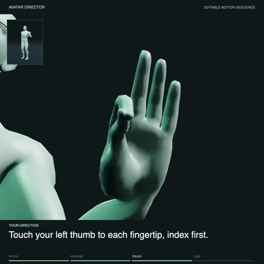</a> | **An articulated avatar with finger-motion instructions** [Yuntian Deng (@yuntiandeng)](https://x.com/yuntiandeng/status/2097805500859519088), X, 2026-09-09 Yuntian Deng writes "GPT-6 Astra helped me rebuild my avatar, joint by joint." The follow-on instruction is "roll a coin across its knuckles"; the attached clip shows the avatar interface, not a physical robot. Tools: No tool named · Archived copy: [video, 17 s](https://frank-zy-dou.github.io/awesome-astra/assets/videos/m47-articulated-avatar-yuntian-deng.mp4) |
| <a href="https://frank-zy-dou.github.io/awesome-astra/assets/videos/m60-fabric-comparison-salma.mp4">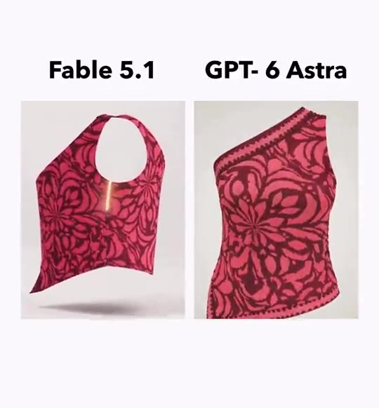</a> | **Fabric and organic-material experiment: Fable versus Astra** [Salma (@Salmaaboukarr)](https://x.com/Salmaaboukarr/status/2097036366064357636), X, 2026-09-07 Salma captions a comparison "Fable 5.1 v GPT- 6 Astra". The embedded earlier post introduces "fabric/organic material experiments with Astra"; the video is the result, with no workflow or timing claim in the caption. Tools: Claude Fable 5.1; GPT-6 Astra; creation software not stated · Archived copy: [video, 10 s](https://frank-zy-dou.github.io/awesome-astra/assets/videos/m60-fabric-comparison-salma.mp4) |

### Game assets and playable worlds

| Preview | Case |
|---|---|
| <a href="https://www.linkedin.com/posts/peterashalaby_when-the-new-openai-astra-model-came-out-activity-7502796636042014720-p-Be">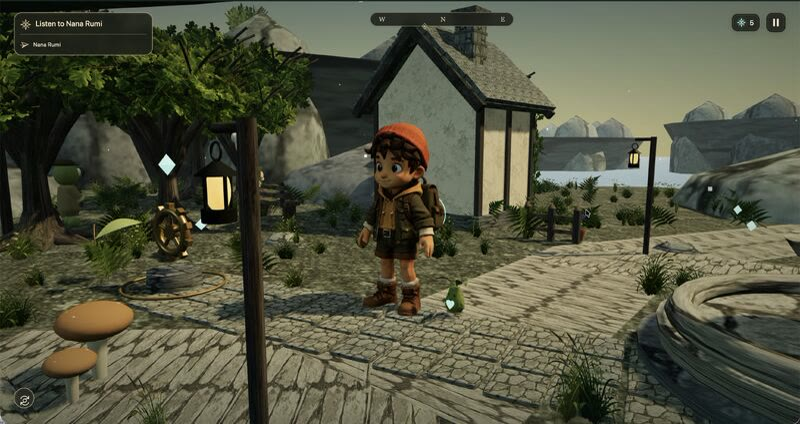</a> | **"Big Boy": a 3D game assembled with Meshy, Blender and Astra** [Peter Shalaby](https://www.linkedin.com/posts/peterashalaby_when-the-new-openai-astra-model-came-out-activity-7502796636042014720-p-Be), LinkedIn, 2026-09-07 The main character was modeled in Meshy, then rigged and animated; Astra "helped me bring everything together into a working game". Playable link in the post. Author: UI, graphics and movement still need work. Tools: Meshy, Blender · Archived copy: [image 1](assets/images/m04-big-boy-game-assets-peter-shalaby-1.jpg) · [image 2](assets/images/m04-big-boy-game-assets-peter-shalaby-2.jpg) · [image 3](assets/images/m04-big-boy-game-assets-peter-shalaby-3.jpg) · [image 4](assets/images/m04-big-boy-game-assets-peter-shalaby-4.jpg) |
| <a href="https://frank-zy-dou.github.io/awesome-astra/assets/videos/m13-unreal-survival-world-mattshumer.mp4">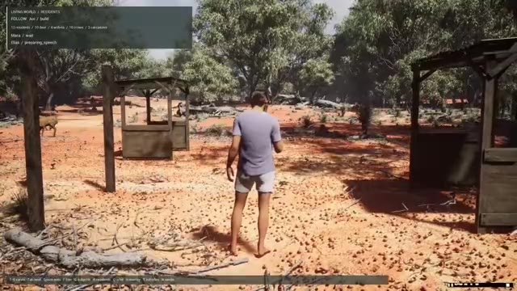</a> | **Unreal Engine world populated with Astra-driven agents** [Matt Shumer (@mattshumer_)](https://x.com/mattshumer_/status/2095596175705399482), X, 2026-09-03 Request: a world in Unreal Engine filled with humans, "each an Astra-powered agent", who must cooperate to survive. The agents started talking to each other. Ten-minute clip, "obviously not 100% perfect yet". Tools: Unreal Engine · Archived copy: [video, 592 s](https://frank-zy-dou.github.io/awesome-astra/assets/videos/m13-unreal-survival-world-mattshumer.mp4) |
| <a href="https://frank-zy-dou.github.io/awesome-astra/assets/videos/m19-blender-game-assets-xikhar.mp4">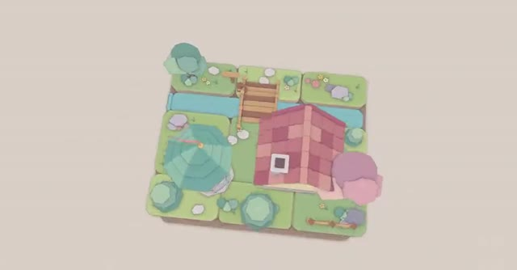</a> | **One-shot game assets in Blender** [Shikhar (@xikhar)](https://x.com/xikhar/status/2095969538290712800), X, 2026-09-04 Author: "Astra is so cracked at Blender. You can literally one-shot game assets with it." Tools: Blender · Archived copy: [video, 20 s](https://frank-zy-dou.github.io/awesome-astra/assets/videos/m19-blender-game-assets-xikhar.mp4) |
| <a href="https://frank-zy-dou.github.io/awesome-astra/assets/videos/m24-van-gogh-town-threejs-petergostev.mp4">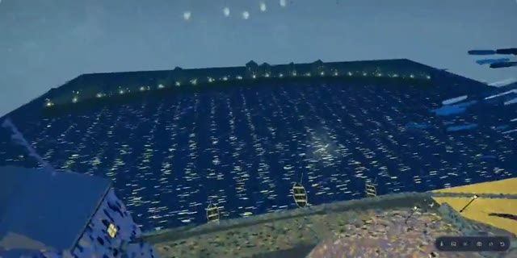</a> | **Six Van Gogh paintings turned into one walkable town (three.js)** [Peter Gostev (@petergostev)](https://x.com/petergostev/status/2095776685807346105), X, 2026-09-04 Built with GPT-6 Astra (Max) and hosted by the author: six paintings by Van Gogh merged into a single town you can walk through. Tools: three.js · Archived copy: [video, 76 s](https://frank-zy-dou.github.io/awesome-astra/assets/videos/m24-van-gogh-town-threejs-petergostev.mp4) Links: [playable town](https://van-goghs-town.surge.sh/) |
| <a href="https://frank-zy-dou.github.io/awesome-astra/assets/videos/m25-kart-racing-game-goofyninjaaa.mp4">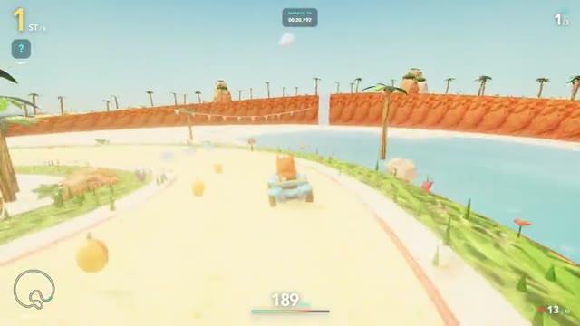</a> | **Tidal Rush: a browser kart game built with Sites in ChatGPT** [Goofy (@goofyninjaaa)](https://x.com/goofyninjaaa/status/2095598834076578261), X, 2026-09-03 Kart racer with 8 racers, 3 laps, drifting, items and physics, built by Pietro Schirano with Sites inside ChatGPT and used by OpenAI as a launch demo, as described in this post sharing the game. Tools: ChatGPT Sites · Archived copy: [video, 80 s](https://frank-zy-dou.github.io/awesome-astra/assets/videos/m25-kart-racing-game-goofyninjaaa.mp4) |
| <a href="https://frank-zy-dou.github.io/awesome-astra/assets/videos/m26-fps-map-rileybrown.mp4">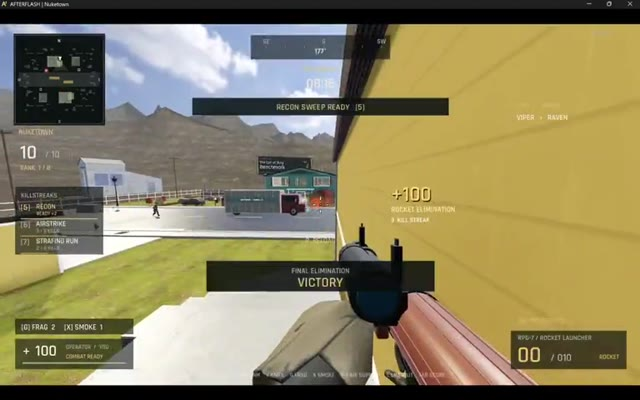</a> | **Playable shooter level built in a morning** [Riley Brown (@rileybrown)](https://x.com/rileybrown/status/2095632207813521534), X, 2026-09-03 Author: "Built this with Astra (GPT 6) this AM." The three-minute video plays through the level. Tools: not stated · Archived copy: [video, 203 s](https://frank-zy-dou.github.io/awesome-astra/assets/videos/m26-fps-map-rileybrown.mp4) |
| <a href="https://frank-zy-dou.github.io/awesome-astra/assets/videos/m27-fall-guys-clone-matthewberman.mp4">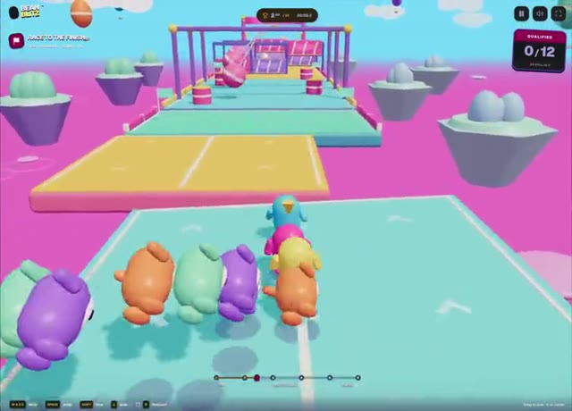</a> | **Fall Guys-style game prototype** [Matthew Berman (@MatthewBerman)](https://x.com/MatthewBerman/status/2095595895584907501), X, 2026-09-03 Posted as "Fall Guys Clone" in the author's thread of Astra test builds. Tools: not stated · Archived copy: [video, 44 s](https://frank-zy-dou.github.io/awesome-astra/assets/videos/m27-fall-guys-clone-matthewberman.mp4) |
| <a href="https://frank-zy-dou.github.io/awesome-astra/assets/videos/m28-ocean-storm-scene-emollick.mp4">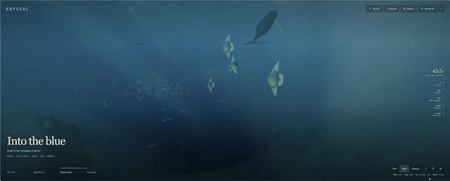</a> | **Procedural ocean extended into a full underwater world** [Ethan Mollick (@emollick)](https://x.com/emollick/status/2095673885605630429), X, 2026-09-04 Starting from TokenGremlin's open-source ABYSSAL ocean and storm generator, Astra was asked "to create the rest of the ocean, including procedural simulations of animal behavior". Demo and source linked from the post. Tools: three.js, WebGL · Archived copy: [video, 64 s](https://frank-zy-dou.github.io/awesome-astra/assets/videos/m28-ocean-storm-scene-emollick.mp4) Links: [playable demo](https://abyssal-living-deep.netlify.app/?site=reef&seed=713&light=day&surface=1) · [source on GitHub](https://github.com/emollick/abyssal-living-deep) |
| <a href="https://frank-zy-dou.github.io/awesome-astra/assets/videos/m29-underwater-gothic-city-emollick.mp4">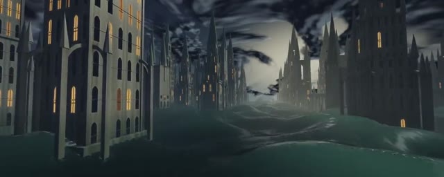</a> | **Drowned neo-gothic city as a twigl shader** [Ethan Mollick (@emollick)](https://x.com/emollick/status/2095712569507885252), X, 2026-09-04 Prompt quoted in the post: "create a visually interesting shader that can run in twigl-dot-app make it like an infinite city of neo-gothic towers partially drowned in a stormy ocean with large waves", followed by "Make it better". Run at the highest reasoning setting. Tools: twigl.app (WebGL) · Archived copy: [video, 13 s](https://frank-zy-dou.github.io/awesome-astra/assets/videos/m29-underwater-gothic-city-emollick.mp4) Links: [shader on twigl](https://twigl.app?ol=true&ss=-P0ePejFIYPf55anBnZ6) |
| <a href="https://frank-zy-dou.github.io/awesome-astra/assets/videos/m34-roblox-racing-scene-givros.mp4">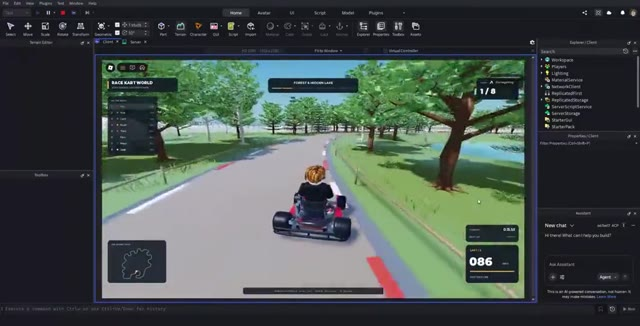</a> | **Roblox racing scene with a custom Astra skill** [Givros (@givros)](https://x.com/givros/status/2101018338763632837), X, 2026-09-18 The caption is "Roblox + GPT 6 Astra + My custom skill". The attached video preview shows a racing scene in Roblox Studio; the post does not explain which assets the skill created. Tools: Roblox; custom skill · Archived copy: [video, 72 s](https://frank-zy-dou.github.io/awesome-astra/assets/videos/m34-roblox-racing-scene-givros.mp4) |
| <a href="https://frank-zy-dou.github.io/awesome-astra/assets/videos/m38-vr-experience-sin-school-ai.mp4">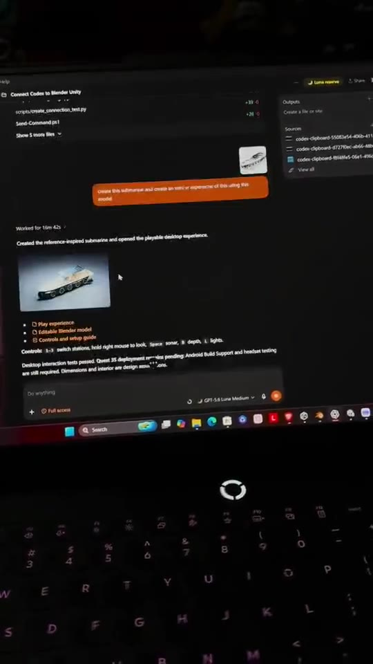</a> | **A 3D VR experience developed with GPT-6 Astra** [SIN School of AI](https://www.linkedin.com/posts/sin-school-of-ai_gpt6astra-virtualreality-artificialintelligence-activity-7504782542999330816-h2YJ), LinkedIn, 2026-09-13 SIN School of AI describes "a complete 3D Virtual Reality experience" made with GPT-6 Astra. The author lists environment design, interactions, logic and gameplay; the attached video includes laptop views of a 3D vehicle, environment and interior. Tools: No creation tool named in the post · Archived copy: [video, 59 s](https://frank-zy-dou.github.io/awesome-astra/assets/videos/m38-vr-experience-sin-school-ai.mp4) |
| <a href="https://x.com/jonathanplumb/status/2098225609558335846">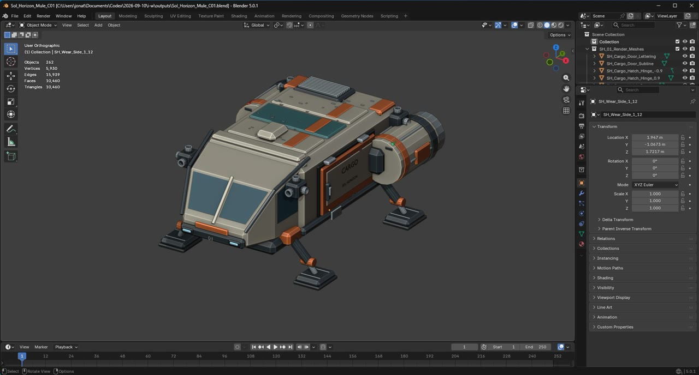</a> | **An unfinished civilian courier spacecraft in Blender** [Jonathan Plumb — Spokane Valley (@jonathanplumb)](https://x.com/jonathanplumb/status/2098225609558335846), X, 2026-09-11 Jonathan Plumb presents an Astra-High spacecraft-modeling attempt and says "It's not finished". The included prompt asks for a civilian courier ship in Blender, collision geometry and a Unity-oriented FBX export; those are requested deliverables, not confirmed exports. Tools: Chat; Work; Blender; Unity/FBX in the prompt · Archived copy: [image 1](assets/images/m41-courier-spacecraft-jonathan-plumb-1.jpg) · [image 2](assets/images/m41-courier-spacecraft-jonathan-plumb-2.jpg) |
| <a href="https://frank-zy-dou.github.io/awesome-astra/assets/videos/m51-komorebi-market-miya.mp4">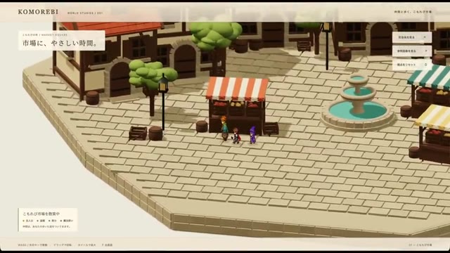</a> | **Komorebi Market: a reference image to an explorable game town** [miya (@miya00907380)](https://x.com/miya00907380/status/2097807257639748070), X, 2026-09-09 miya describes generating a town reference image and turning it into a game-town model with GPT-6 Astra. The post says "その街を歩き回れるようにしました" (the author made the town walkable) using a character from the existing Mystic Forest Three project. The linked demonstration is Komorebi Market. Links: [project/source 1](https://komorebi-market-town.miya333.chatgpt.site/) Tools: Codex (gpt-6-astra medium); imagegen skill; img2threejs skill; Three.js; HTML5; TypeScript; Vite; Playwright · Archived copy: [video, 60 s](https://frank-zy-dou.github.io/awesome-astra/assets/videos/m51-komorebi-market-miya.mp4) |
| <a href="https://frank-zy-dou.github.io/awesome-astra/assets/videos/m57-skyrim-village-tarokichijo.mp4">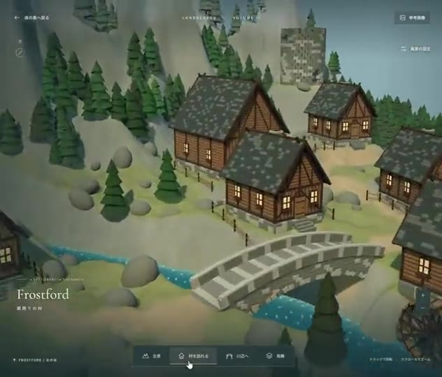</a> | **Skyrim-style village terrain with img2threejs** [Kichitaro (Kichi Shotaro) (@TaroKichijo)](https://x.com/TaroKichijo/status/2097167383576383502), X, 2026-09-08 Kichitaro tests "GPT-6 Astra（Medium）" with a prompt requesting village terrain like Skyrim. The request includes "参考画像は自分で作ってください" (make the reference image yourself), and the post attaches the image and a scene video. Tools: Codex; img2threejs skill; GPT-6 Astra Medium · Archived copy: [video, 21 s](https://frank-zy-dou.github.io/awesome-astra/assets/videos/m57-skyrim-village-tarokichijo.mp4) · [image](assets/images/m57-skyrim-village-tarokichijo-p1.jpg) |
| <a href="https://frank-zy-dou.github.io/awesome-astra/assets/videos/m67-game-world-expansion-anshuc.mp4">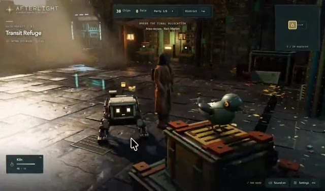</a> | **An overnight 3D game-world expansion with Blender assets** [Anshu (@anshuc)](https://x.com/anshuc/status/2096584624432374151), X, 2026-09-06 Anshu describes a further Astra game-world build: "It worked all night on weather effects, Blender modeling, and tons of little details." The post quotes his earlier GPT-6 Astra game demonstration and includes the expanded scene. Tools: Blender; image generation in the quoted earlier post · Archived copy: [video, 30 s](https://frank-zy-dou.github.io/awesome-astra/assets/videos/m67-game-world-expansion-anshuc.mp4) |
| <a href="https://frank-zy-dou.github.io/awesome-astra/assets/videos/m68-pequod-game-alfred-andrews.mp4">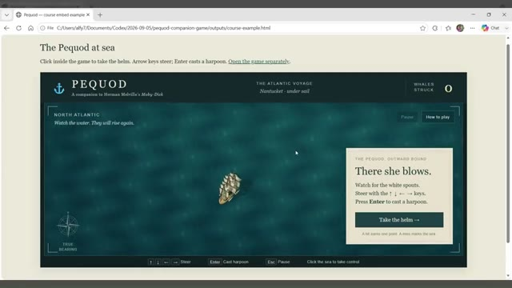</a> | **Moby-Dick-inspired Pequod game made through voice prompts** [Alfred Andrews](https://www.linkedin.com/posts/alfred-andrews-a79295a_from-classic-novel-to-interactive-adventure-activity-7501918834925125632-Djwq), LinkedIn, 2026-09-05 Alfred Andrews presents an interactive adventure inspired by Moby-Dick, with the Pequod shown in the attached game interface. The author says he built it by "simply talking to GPT-6 Astra", using voice prompts to guide development. Tools: Voice prompts; no engine named · Archived copy: [video, 504 s](https://frank-zy-dou.github.io/awesome-astra/assets/videos/m68-pequod-game-alfred-andrews.mp4) |
| <a href="https://frank-zy-dou.github.io/awesome-astra/assets/videos/m69-unity-city-andrew-walko.mp4">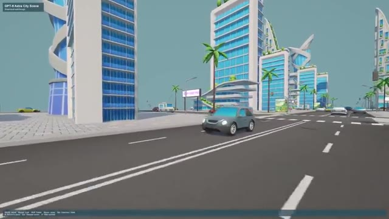</a> | **Unity city assembled from existing assets with skills and CLI** [Unity](https://www.linkedin.com/posts/unity_icymi-openai-recently-launched-gpt-6-astra-activity-7502048381536632832-3Eaa), LinkedIn, 2026-09-05 Unity shares Andrew Walko's workflow for a GPT-6 Astra launch environment. The embedded original describes downloading city assets, using Unity skills and CLI, and enabling computer use to inspect and adjust the scene. Walko calls the build "all in 1 shot!"; this is scene assembly from existing assets, not evidence that Astra modeled every asset. Links: [project/source 1](https://www.linkedin.com/feed/update/urn:li:activity:7501754602850082816/) Creator: Andrew Walko; the candidate post is Unity's native reshare. [Creator original](https://www.linkedin.com/feed/update/urn:li:activity:7501754602850082816/), 2026-09-04. Tools: Unity; Unity skills; Unity CLI; Codex; computer use; Unity Asset Store city assets · Archived copy: [video, 13 s](https://frank-zy-dou.github.io/awesome-astra/assets/videos/m69-unity-city-andrew-walko.mp4) |
| <a href="https://frank-zy-dou.github.io/awesome-astra/assets/videos/m79-sonic-godot-effort-aibattle.mp4">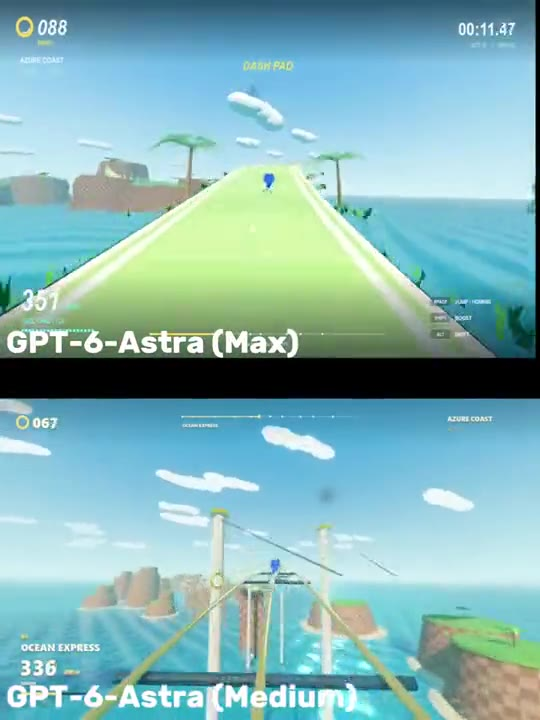</a> | **Sonic-style Godot game: Max and Medium effort compared** [AiBattle (@AiBattle_)](https://x.com/AiBattle_/status/2095994051354919049), X, 2026-09-04 AiBattle compares Astra settings on a "Simple 3D Sonic Game In Godot". The author reports "Max took 53 minutes" and "Medium took 25 minutes"; these are the author's run timings, not a controlled general speed benchmark. Tools: Godot; GPT-6 Astra Max; GPT-6 Astra Medium · Archived copy: [video, 41 s](https://frank-zy-dou.github.io/awesome-astra/assets/videos/m79-sonic-godot-effort-aibattle.mp4) |
| <a href="https://www.youtube.com/watch?v=QYxe4GzW3Ws">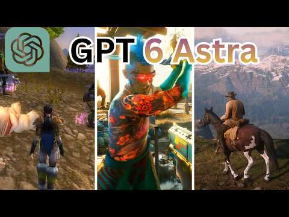</a> | **Three game prototypes inspired by Cyberpunk, Warcraft and Red Dead** [Koviq](https://www.youtube.com/watch?v=QYxe4GzW3Ws), YouTube, 2026-09-05 Koviq presents an Astra game-making test inspired by "Red dead Redemption 2, Cyberpunk, and World of Warcraft". The original description lists gameplay and bug-discussion chapters; these are prototypes inspired by those games, not demonstrated complete recreations. Tools: Blender in the original title; GPT 6 Astra · Archived copy: [thumbnail](assets/images/m80-three-game-prototypes-koviq.jpg) |

### Workflows and tooling

| Preview | Case |
|---|---|
| <a href="https://frank-zy-dou.github.io/awesome-astra/assets/videos/m20-computer-use-3d-workflow-aigeboku-1.mp4">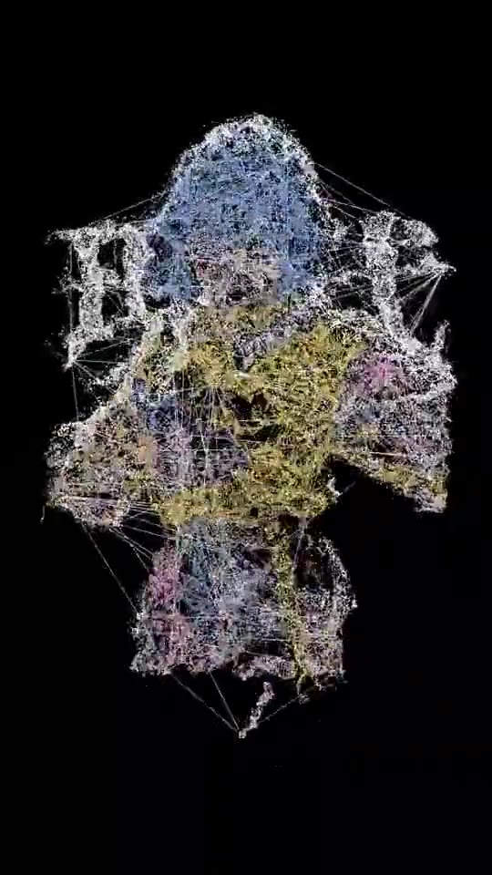</a> | **Particle-dance animation recreated in TouchDesigner through computer use** [AI様の下僕 (@aigeboku)](https://x.com/aigeboku/status/2096187322924687799), X, 2026-09-05 A screen-recorded reference clip recreated as a TouchDesigner particle animation (about 14 s, 576x1024, with the .toe/.tox project files exported), driven through Astra's computer use at the Ultra setting, as the session screenshot shows. The author says a one-shot result is hard but the output is a good base to refine from. Two clips (recreation and reference) and the screenshot. Tools: TouchDesigner, Astra computer use (Ultra setting) · Archived copy: [video 1, 14 s](https://frank-zy-dou.github.io/awesome-astra/assets/videos/m20-computer-use-3d-workflow-aigeboku-1.mp4) · [video 2, 14 s](https://frank-zy-dou.github.io/awesome-astra/assets/videos/m20-computer-use-3d-workflow-aigeboku-2.mp4) · [image](assets/images/m20-computer-use-3d-workflow-aigeboku-p1.jpg) |
| <a href="https://frank-zy-dou.github.io/awesome-astra/assets/videos/m23-blender-mcp-tripo-gui-luccacerf.mp4">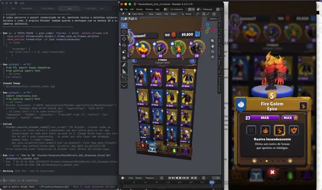</a> | **GUI built with Blender MCP, Astra and Tripo** [Lucca Cerf (@luccacerf)](https://x.com/luccacerf/status/2097047098281672782), X, 2026-09-07 Author: "First time building a gUI with Blender MCP +Astra +Tripo. This is insane." Tools: Blender MCP, Tripo · Archived copy: [video, 30 s](https://frank-zy-dou.github.io/awesome-astra/assets/videos/m23-blender-mcp-tripo-gui-luccacerf.mp4) |
| <a href="https://frank-zy-dou.github.io/awesome-astra/assets/videos/m30-museum-camera-previs-higgsfield.mp4">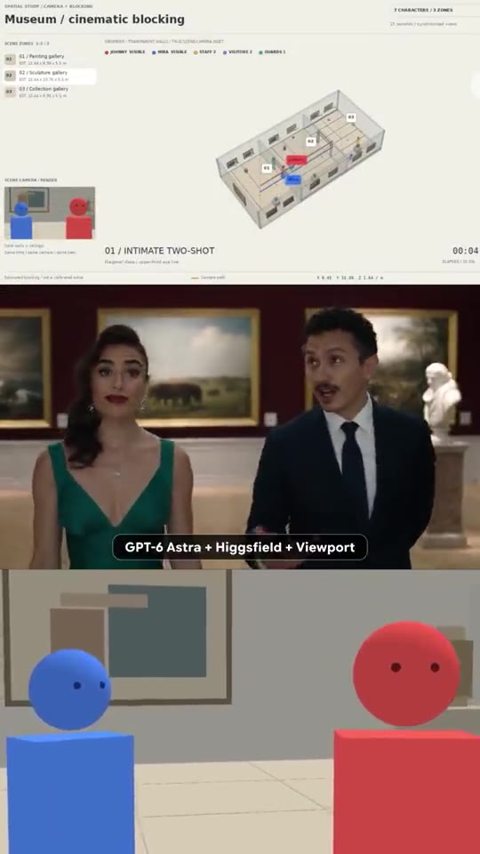</a> | **Previs: museum scene, cast and shot list blocked in 3D** [Higgsfield AI 🧩 (@higgsfield_ai)](https://x.com/higgsfield_ai/status/2095616529572503593), X, 2026-09-03 Astra "mapped the museum, the cast and the shot list"; the blocking stayed in the 3D viewport and Higgsfield's Seedance 2.5 rendered each setup. Tools: Higgsfield, Seedance 2.5 · Archived copy: [video, 15 s](https://frank-zy-dou.github.io/awesome-astra/assets/videos/m30-museum-camera-previs-higgsfield.mp4) |
| <a href="https://frank-zy-dou.github.io/awesome-astra/assets/videos/m02-waterloo-scene-review-dan-shipper.mp4">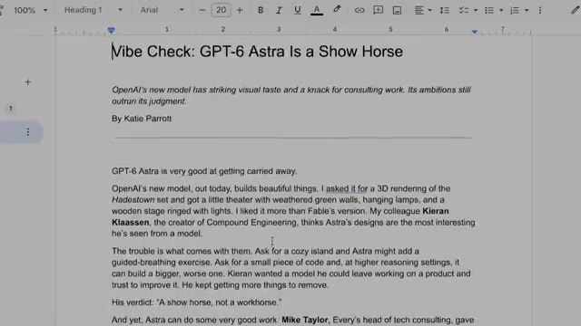</a> | **Day-one review with a one-shot Battle of Waterloo scene** [Dan Shipper](https://www.linkedin.com/posts/danshipper_openai-just-dropped-gpt-6-astra-we-activity-7501414922548072448-UcJV), LinkedIn, 2026-09-03 Every's launch-day review; the clip scrolls through the written vibe check. On 3D: "It can make beautiful 3D worlds from a single prompt. I one-shotted a historically accurate rendition of the Battle of Waterloo." The review also notes a tendency to overcomplicate interfaces. Tools: not stated · Archived copy: [video, 398 s](https://frank-zy-dou.github.io/awesome-astra/assets/videos/m02-waterloo-scene-review-dan-shipper.mp4) |
|  | **First 3D model on a Surface Pro, no prior experience** [Ka Kwan Chau](https://www.linkedin.com/posts/ka-kwan-chau-521a3312a_gpt-6-astra-is-now-available-across-microsofts-activity-7502674693011853312-2JHY), LinkedIn, 2026-09-07 Post on Astra's availability across Microsoft platforms; the author also built a 3D model on a Surface Pro 13 "with no prior 3D experience". Four screenshots. Tools: Blender · Archived copy: [image 1](assets/images/m06-surface-pro-modeling-test-ka-kwan-chau-1.jpg) · [image 2](assets/images/m06-surface-pro-modeling-test-ka-kwan-chau-2.jpg) · [image 3](assets/images/m06-surface-pro-modeling-test-ka-kwan-chau-3.jpg) · [image 4](assets/images/m06-surface-pro-modeling-test-ka-kwan-chau-4.jpg) |
| <a href="https://frank-zy-dou.github.io/awesome-astra/assets/videos/m33-city-scene-custom-skill-givros.mp4">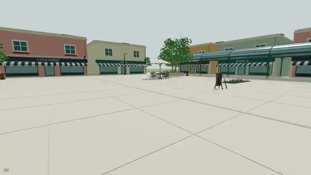</a> | **Blender-to-Three.js city scene with a custom Astra skill** [Givros (@givros)](https://x.com/givros/status/2100823693421093336), X, 2026-09-18 Givros captions the demonstration "GPT 6 Astra + My custom Skill (blender mcp - ThreeJs)". The attached video preview shows a browser city scene; the post gives no build time or autonomy claim. Tools: Blender MCP; Three.js; custom skill · Archived copy: [video, 102 s](https://frank-zy-dou.github.io/awesome-astra/assets/videos/m33-city-scene-custom-skill-givros.mp4) |
| <a href="https://x.com/_sagyoai/status/2098980384260456813">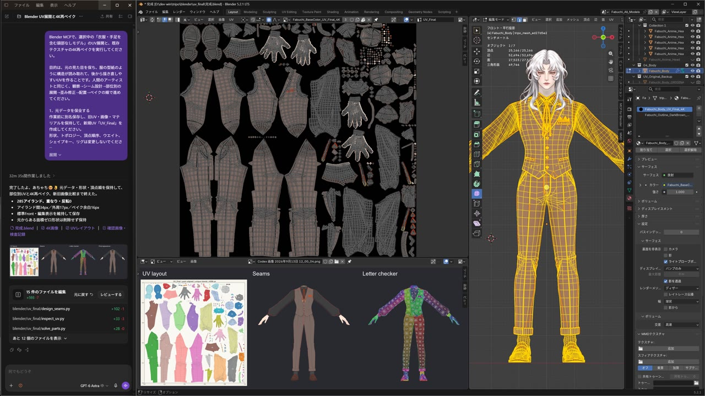</a> | **UV unwrapping and texture rebaking with Tripo and Blender MCP** [さ🥺 (@_sagyoai)](https://x.com/_sagyoai/status/2098980384260456813), X, 2026-09-13 The author presents an Astra UV-unwrapping test on a Tripo model and says "１回プロンプト送るだけでできたわよ！" (the author reports doing it with one prompt). The post includes a UV-layout image and the full requested seam, distortion-check and texture-rebaking workflow; the requested output specifications are not independently measured. Tools: Tripo; Blender MCP · Archived copy: [image](assets/images/m39-uv-unwrapping-sagyoai.jpg) |
| <a href="https://frank-zy-dou.github.io/awesome-astra/assets/videos/m40-street-robot-vfx-higgsfield.mp4">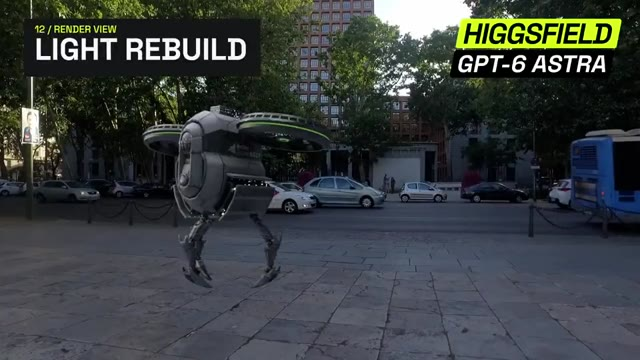</a> | **Street footage and a robot model to a Blender/After Effects VFX shot** [Higgsfield AI 🧩 (@higgsfield_ai)](https://x.com/higgsfield_ai/status/2098852559180193891), X, 2026-09-12 Higgsfield states "GPT-6 Astra turned street footage and a 3D model into a finished VFX shot." The listed workflow covers camera solving, robot lighting and rendering, matching blur and grain, and compositing. Tools: Higgsfield; Blender; After Effects · Archived copy: [video, 26 s](https://frank-zy-dou.github.io/awesome-astra/assets/videos/m40-street-robot-vfx-higgsfield.mp4) |
| <a href="https://frank-zy-dou.github.io/awesome-astra/assets/videos/m70-scene-camera-reference-jerrod-lew.mp4">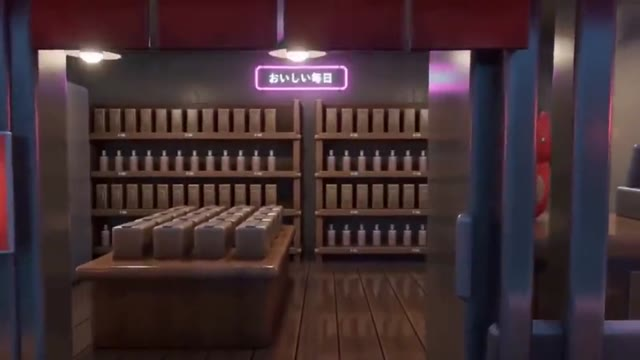</a> | **A Blender scene and camera motion used as an AI-video reference** [Jerrod Lew](https://www.linkedin.com/posts/jerrod-lew_gpt-6-astra-can-create-amazing-3d-models-activity-7502110526278107137-nogZ), LinkedIn, 2026-09-05 Jerrod Lew describes GPT-6 Astra modeling and camera-keyframing work in Blender through MCP. He says "I brought my output to Magnific" for the final treatment; the original preview shows a stylized shop scene. Tools: Blender; MCP; Magnific; MiniMax H3 named as an example · Archived copy: [video, 32 s](https://frank-zy-dou.github.io/awesome-astra/assets/videos/m70-scene-camera-reference-jerrod-lew.mp4) |
| <a href="https://frank-zy-dou.github.io/awesome-astra/assets/videos/m76-keyboard-previz-yasir-ameen.mp4">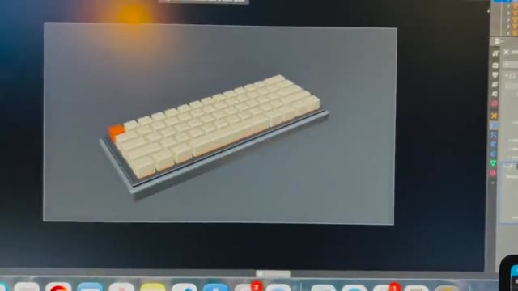</a> | **Keyboard product-film previsualization through a live Codex conversation** [Yasir Ameen](https://www.linkedin.com/posts/yasir-ameen-60971894_it-was-4-am-and-i-was-directing-a-blender-activity-7501788620236800000-M8Kv), LinkedIn, 2026-09-04 Yasir Ameen describes a keyboard scene, keypress animation and camera-path refinement while talking with OpenAI Astra through Codex. He calls the attached result a "Blender motion reference"; feeding it to an AI-video model is described as the next step. Tools: Codex; Blender · Archived copy: [video, 616 s](https://frank-zy-dou.github.io/awesome-astra/assets/videos/m76-keyboard-previz-yasir-ameen.mp4) |
| <a href="https://www.youtube.com/watch?v=lrTuh5uT8YU">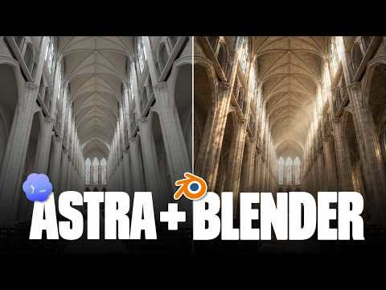</a> | **Blender cathedral and character animation: Astra compared with an earlier Fable test** [Aidan Stanik](https://www.youtube.com/watch?v=lrTuh5uT8YU), YouTube, 2026-09-04 Aidan Stanik tests Astra using the "Same reference image and same prompt I gave Claude Fable 5.1 a few days ago". The original chapters identify a cathedral scene and animation of an existing rigged character, including a backflip, wave and facial-rig test. Tools: Blender; GPT-6 Astra; Claude Fable 5.1 comparison · Archived copy: [thumbnail](assets/images/m81-cathedral-animation-aidan-stanik.jpg) |
| <a href="https://frank-zy-dou.github.io/awesome-astra/assets/videos/m82-jet-engine-viewer-youware.mp4">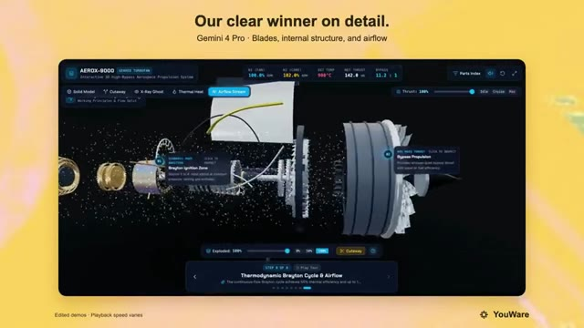</a> | **Interactive 3D jet engine with cutaway and airflow views, compared across models** [YouWare (@YouWareAI)](https://x.com/YouWareAI/status/2101271938706685991), X, 2026-09-19 Author: "I ran the same prompt against GPT-6 Astra and put the side-by-side in this clip. Interactive 3D jet engine: cutaway, x-ray, airflow, the works." The post compares the output with one it attributes to Gemini 4 Pro on Arena and judges that build stronger. The Gemini attribution is the author's: Google's model page listed no Gemini 4 on 2026-09-20, and Arena showed the labels gemini-3.7-flash and gemini-3.8-flash. The prompt is linked in the replies; nothing in the post measures geometric or engineering fidelity. Tools: Three.js, YouWare · Archived copy: [video, 52 s](https://frank-zy-dou.github.io/awesome-astra/assets/videos/m82-jet-engine-viewer-youware.mp4) |
| <a href="https://frank-zy-dou.github.io/awesome-astra/assets/videos/m83-catfu-motion-reference-pixverse.mp4">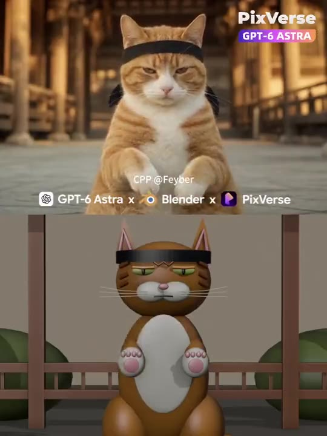</a> | **Catfu motion reference in Blender, then a generated video** [PixVerse (@PixVerse)](https://x.com/PixVerse/status/2101310374033428642), X, 2026-09-19 Post: "The lost art of catfu, brought back to life with GPT-6 Astra + Blender. Created by PixVerse creator @woleswoosh". The Blender stage produces the motion reference; the photorealistic result comes from the separate video pipeline, so the final imagery is not attributable to the modeling step alone. Tools: Blender, PixVerse, Seedance 2.5 · Archived copy: [video, 10 s](https://frank-zy-dou.github.io/awesome-astra/assets/videos/m83-catfu-motion-reference-pixverse.mp4) |

## Industrial Design and CAD

### Parametric CAD and solid modeling

| Preview | Case |
|---|---|
| <a href="https://frank-zy-dou.github.io/awesome-astra/assets/videos/i02-solidworks-robot-arm-mecagent.mp4">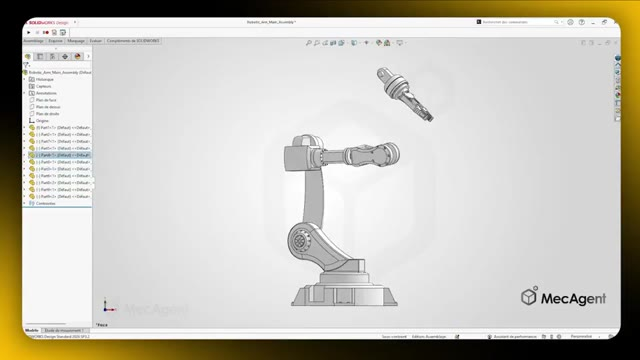</a> | **Robot-arm assembly in SolidWorks 2026 (MecAgent harness)** [Alexandre Senet](https://www.linkedin.com/posts/alexandre-senet_ai-cad-solidworks-activity-7504185298239672320-VNfe), LinkedIn, 2026-09-11 · [MecAgent company post](https://www.linkedin.com/posts/mecagentinc_ai-cad-solidworks-activity-7504185599742894081-vWpD), LinkedIn, 2026-09-11 One prompt: 11 parts, 1 main assembly, 35-minute run. The model is parametric with a feature tree and fully editable, "but it is not yet fully constrained"; the assembly rotates about its intended axes, with the remaining constraint issues in the sketches. MecAgent states it is an independent tool, not a SOLIDWORKS partner. Tools: SolidWorks 2026, MecAgent · Archived copy: [video, 24 s](https://frank-zy-dou.github.io/awesome-astra/assets/videos/i02-solidworks-robot-arm-mecagent.mp4) Also shared by: [Md Shayan Elias Rahib](https://www.linkedin.com/posts/rahib-elias_cad-expertise-alone-is-quickly-becoming-obsolete-activity-7505184515972145153-hD35) (LinkedIn, 2026-09-14); [Mintaka-AI](https://www.linkedin.com/posts/mintaka-ai-tools_gpt-6-astra-on-cad-solidworks-2026-with-activity-7504260399886745600-GvOX) (LinkedIn, 2026-09-11); [Pranava Sai Chintala](https://www.linkedin.com/posts/pranava-sai-chintala_ai-cad-solidworks-activity-7504415362931752960-HENE) (LinkedIn, 2026-09-12) |
| <a href="https://frank-zy-dou.github.io/awesome-astra/assets/videos/i03-solidworks-turbojet-mecagent.mp4">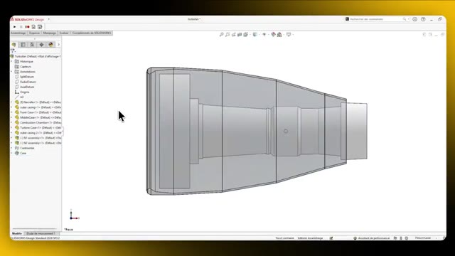</a> | **Turbojet engine assembly in SolidWorks 2026 (MecAgent harness)** [Alexandre Senet](https://www.linkedin.com/posts/alexandre-senet_ai-cad-solidworks-activity-7502728406267064320-d6mW), LinkedIn, 2026-09-07 · [MecAgent company post](https://www.linkedin.com/posts/mecagentinc_ai-cad-solidworks-activity-7502734104778477569-U9mu), LinkedIn, 2026-09-07 One prompt: 41 parts, 2 sub-assemblies, 1 main assembly, 57-minute run. Parametric with a feature tree; the turbine rotates about its axis together with the components it drives; "not yet perfectly constrained". Tools: SolidWorks 2026, MecAgent · Archived copy: [video, 23 s](https://frank-zy-dou.github.io/awesome-astra/assets/videos/i03-solidworks-turbojet-mecagent.mp4) Follow-up: [MecAgent (@MecAgent)](https://x.com/MecAgent/status/2097676816592797816) (X, 2026-09-09): X cross-post of the MecAgent turbojet assembly demonstration, using SolidWorks 2026 and the MecAgent harness. |
| <a href="https://www.linkedin.com/posts/julianvarghese_cgm-python-mcp-activity-7503345279170060288-XsVN">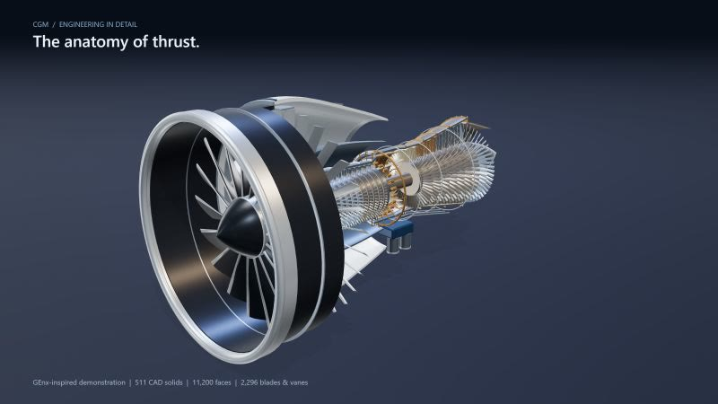</a> | **Turbofan concept as a solid B-rep through a CGM MCP server** [Julian Varghese](https://www.linkedin.com/posts/julianvarghese_cgm-python-mcp-activity-7503345279170060288-XsVN), LinkedIn, 2026-09-09 CGM (the modeling kernel under CATIA V5) wrapped in Python and exposed as an MCP server by James Gray. One prompt in an Astra (medium) session produced, per the author, 511 solid bodies, 11,200 faces and 2,296 blades and vanes, exported to XCGM and STEP, with all bodies passing CGM's B-rep checker, plus presentation images and a web viewer. Under 30 minutes. "An illustrative model, not an OEM design." Four images. Tools: CGM kernel, Python, MCP · Archived copy: [image 1](assets/images/i04-cgm-turbofan-brep-julian-varghese-1.jpg) · [image 2](assets/images/i04-cgm-turbofan-brep-julian-varghese-2.jpg) · [image 3](assets/images/i04-cgm-turbofan-brep-julian-varghese-3.jpg) · [image 4](assets/images/i04-cgm-turbofan-brep-julian-varghese-4.jpg) |
| <a href="https://frank-zy-dou.github.io/awesome-astra/assets/videos/i09-drawing-to-onshape-adam-zach-dive.mp4">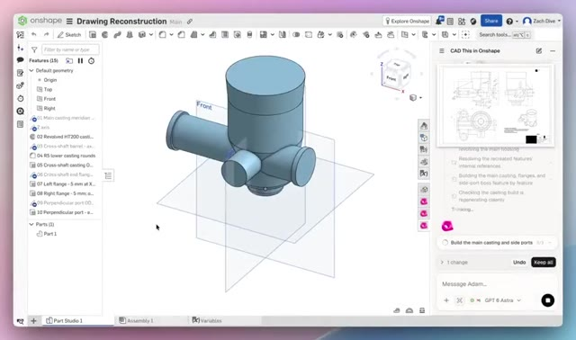</a> | **Technical drawing to native Onshape CAD with the Adam harness** [Zach Dive](https://www.linkedin.com/posts/zacharydive_drawing-to-cad-is-solved-using-the-adam-harness-activity-7505672460990599170-LfSn), LinkedIn, 2026-09-15 Zach Dive presents a drawing-to-CAD demonstration and writes "Drawing to CAD is solved using the Adam harness with GPT-6 Astra." The post asks viewers to "Watch it drive the generation natively in Onshape by PTC"; "solved" is the author's claim, not a reliability finding. Tools: Adam harness; Onshape by PTC · Archived copy: [video, 25 s](https://frank-zy-dou.github.io/awesome-astra/assets/videos/i09-drawing-to-onshape-adam-zach-dive.mp4) |

### Product design and prototypes

| Preview | Case |
|---|---|
| <a href="https://frank-zy-dou.github.io/awesome-astra/assets/videos/i01-ikea-chair-photo-to-model-doron-taussy.mp4">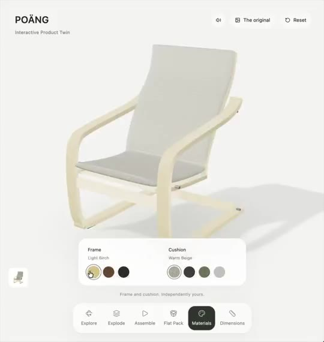</a> | **IKEA chair photo to an interactive product model** [Doron Taussy](https://www.linkedin.com/posts/doron-taussy_i-gave-astra-one-photo-of-an-ikea-chair-and-activity-7503069971481182209-ay6a), LinkedIn, 2026-09-08 One photo of an IKEA chair. Astra built it in Blender and turned it into an interactive product with dimensions, material switching, part inspection, exploded view, flat-pack mode and self-assembly. Tools: Blender · Archived copy: [video, 56 s](https://frank-zy-dou.github.io/awesome-astra/assets/videos/i01-ikea-chair-photo-to-model-doron-taussy.mp4) |
| <a href="https://frank-zy-dou.github.io/awesome-astra/assets/videos/i06-3d-ipod-mac-app-skirano.mp4">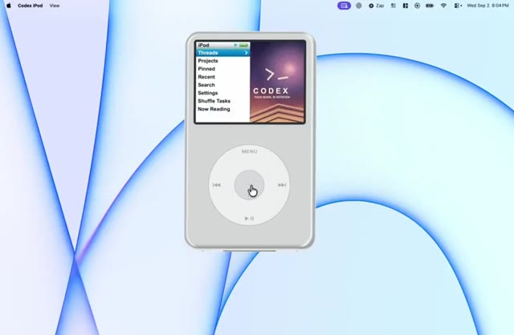</a> | **Mac app with a Blender-built 3D iPod interface** [Pietro Schirano (@skirano)](https://x.com/skirano/status/2095648379455861054), X, 2026-09-03 Prompt quoted in the post: "make me a Mac app. It should render a 3D iPod that you'll build in Blender, then using the original iPod UI and interactions I want to be able to visualize all my Codex threads on it." Delivered 15 minutes later. Tools: Blender, macOS app · Archived copy: [video, 35 s](https://frank-zy-dou.github.io/awesome-astra/assets/videos/i06-3d-ipod-mac-app-skirano.mp4) |
| <a href="https://x.com/skirano/status/2095602672837521416">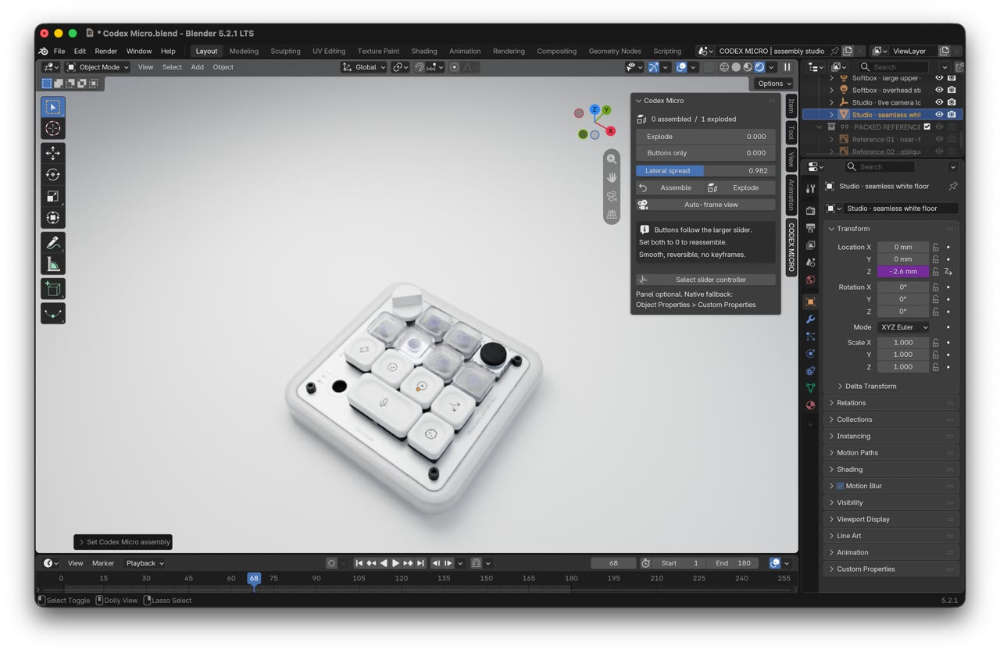</a> | **Codex Micro modeled in Blender from one reference image** [Pietro Schirano (@skirano)](https://x.com/skirano/status/2095602672837521416), X, 2026-09-03 Prompt: "Make this in Blender", with a reference image attached; modeled entirely through code. Two images: the result and the reference. Tools: Blender · Archived copy: [image 1](assets/images/i07-codex-micro-model-skirano-1.jpg) · [image 2](assets/images/i07-codex-micro-model-skirano-2.jpg) |
| &nbsp; | **Where generative CAD stands: a practitioner's note** [Adam Keating](https://www.linkedin.com/posts/adammichaelkeating_astra-is-far-better-at-understanding-geometry-activity-7503061853816696832-7CRf), LinkedIn, 2026-09-08 Commentary after a weekend of AI CAD demos. Geometry that "looks like the thing you want" is now easy to get; "The gap remains in the last mile - particularly in manufacturing." The author built a generative-CAD demo in three prompts. Text only. |
| <a href="https://frank-zy-dou.github.io/awesome-astra/assets/videos/i08-tendon-driven-robot-hand-design-earthtojake.mp4">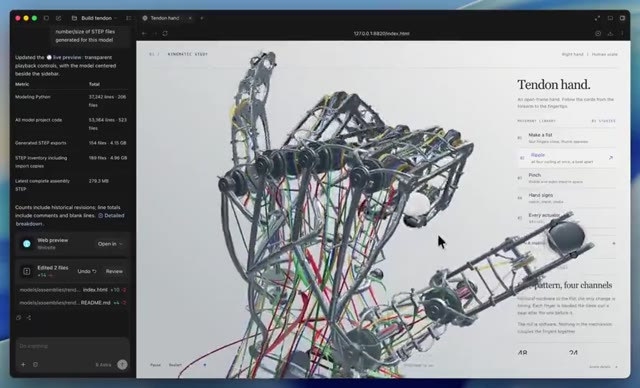</a> | **A tendon-driven robot hand designed by Astra** [Jake Fitzgerald (@earthtojake)](https://x.com/earthtojake/status/2097789988670709821), X, 2026-09-09 Author: "Astra designed a tendon-driven robot hand". The archived clip shows the design; the post gives no further detail on the tools or on whether the hand was built. Tools: not stated in the post · Archived copy: [video, 29 s](https://frank-zy-dou.github.io/awesome-astra/assets/videos/i08-tendon-driven-robot-hand-design-earthtojake.mp4) |
| <a href="https://x.com/wada/status/2098774359926297011">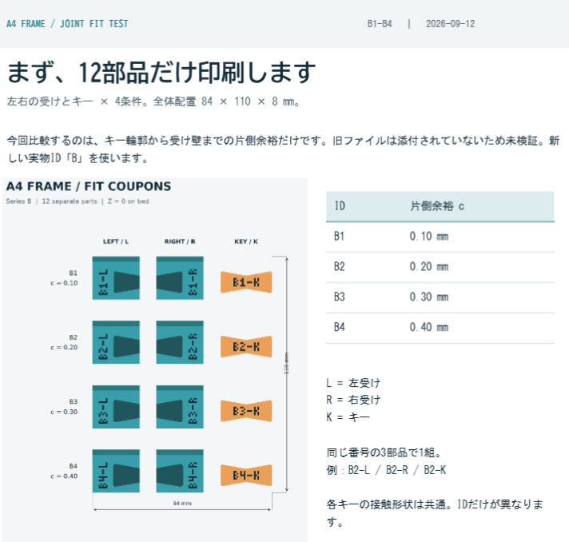</a> | **Printable picture-frame joints: calibration STL parts** [wada (@wada)](https://x.com/wada/status/2098774359926297011), X, 2026-09-12 Asked about a picture frame assembled from printable parts, Astra instead supplied "継手部分のID付きSTL" (identified joint-section STL files). The author explains that these are for adjusting printer and filament error, rather than a completed frame. Tools: STL; 3D printer (model not stated) · Archived copy: [image](assets/images/i10-frame-joint-calibration-wada.jpg) |
| <a href="https://frank-zy-dou.github.io/awesome-astra/assets/videos/i11-mini-dj-controller-eminimnim.mp4">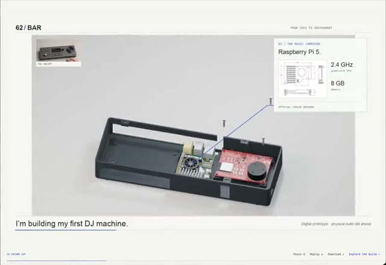</a> | **Mini DJ controller: concept, parts, CAD and assembly animation** [nim (@eminimnim)](https://x.com/eminimnim/status/2098072497182666987), X, 2026-09-10 nim says "I gave Astra my credit card and asked for a Teenage Engineering-style mini DJ controller." The author reports concept generation, component sourcing, CAD and a Blender assembly animation; this is not a report of a physically assembled, tested controller. Tools: CAD tool not named; Blender · Archived copy: [video, 14 s](https://frank-zy-dou.github.io/awesome-astra/assets/videos/i11-mini-dj-controller-eminimnim.mp4) |
| <a href="https://frank-zy-dou.github.io/awesome-astra/assets/videos/i12-garden-room-gym-shaun-stone.mp4">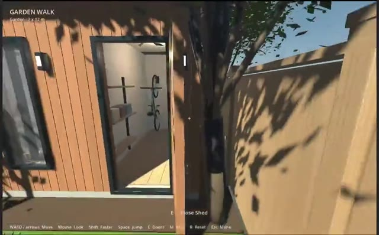</a> | **Garden-room gym: CAD plan to Blender and a Godot walkthrough** [Shaun Michael Stone](https://www.linkedin.com/posts/shaunmstone_ai-claude-astra-activity-7503021951695736832-dt7O), LinkedIn, 2026-09-08 Shaun Michael Stone uses GPT Astra to turn a garden-building CAD plan into a Blender model, then credits Claude Opus with the Godot integration. His walkthrough changes his assessment of the layout: "That multi-gym might be a little ambitious." Tools: 2D CAD (tool not named); Blender; GPT Astra; Claude Opus; Godot · Archived copy: [video, 39 s](https://frank-zy-dou.github.io/awesome-astra/assets/videos/i12-garden-room-gym-shaun-stone.mp4) |
| <a href="https://frank-zy-dou.github.io/awesome-astra/assets/videos/i13-bluetooth-wearable-i2cjak.mp4">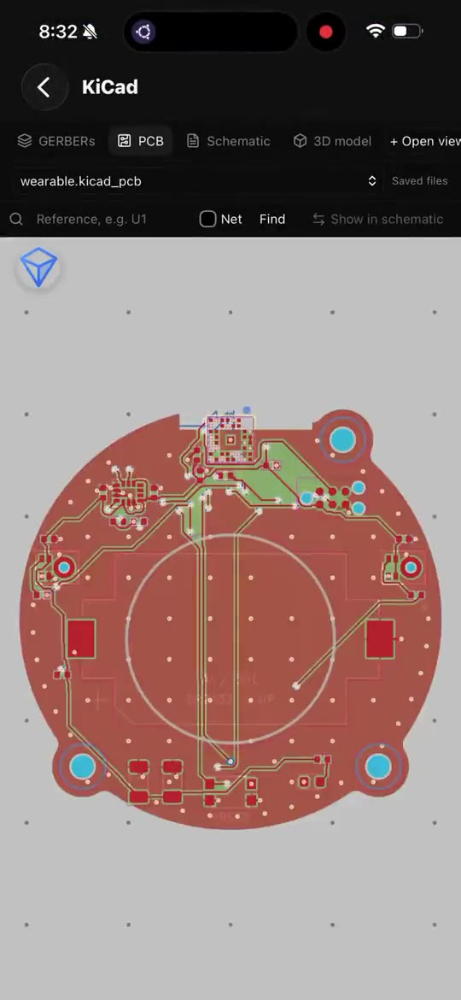</a> | **Bluetooth AI wearable designed with KiStack and T3CAD** [i²cjak (@i2cjak)](https://x.com/i2cjak/status/2096761552317616258), X, 2026-09-07 i²cjak describes an Astra-Medium design for "a Bluetooth AI wearable with two mics for beam forming, IMU, LED, button." The post names KiStack and T3CAD and includes a circuit-board render and a conversation video; it does not report a fabricated, working device. Tools: KiStack; T3CAD (author's T3Code fork); Bluetooth; microphones; IMU; LED; button · Archived copy: [video, 12 s](https://frank-zy-dou.github.io/awesome-astra/assets/videos/i13-bluetooth-wearable-i2cjak.mp4) · [image](assets/images/i13-bluetooth-wearable-i2cjak-p1.jpg) |
| <a href="https://frank-zy-dou.github.io/awesome-astra/assets/videos/i14-sentinel-stage-lighting-cerspense.mp4">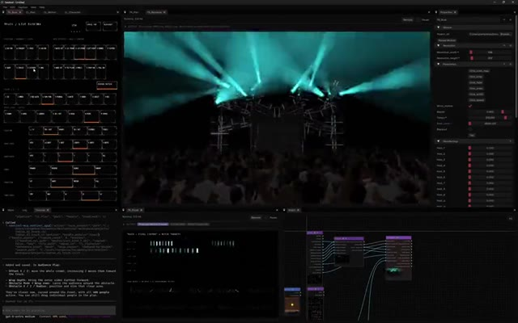</a> | **Sentinel stage simulation, fixture models and lighting controls** [Spencer Sterling (@cerspense)](https://x.com/cerspense/status/2096960824535572498), X, 2026-09-07 Spencer Sterling reports "Astra built me an entire stage simulation and control system in Sentinel." The attached video shows the lighting scene; the author's desire to "bring this into reality" makes physical implementation a future step. Tools: Sentinel; Depence2 mentioned as comparison · Archived copy: [video, 16 s](https://frank-zy-dou.github.io/awesome-astra/assets/videos/i14-sentinel-stage-lighting-cerspense.mp4) Follow-up: [Spencer Sterling (@cerspense)](https://x.com/cerspense/status/2096743983015956860) (X, 2026-09-06): Earlier Sentinel fixture-modeling demonstration, based on the author's lighting specification sheets. |
| <a href="https://frank-zy-dou.github.io/awesome-astra/assets/videos/i15-cessna-landing-gear-dilum-sanjaya.mp4">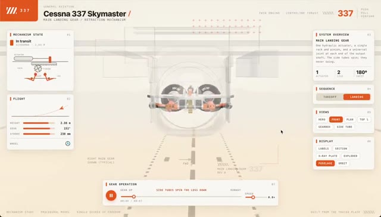</a> | **Cessna 337 landing-gear mechanism reconstructed from video** [Dilum Sanjaya (@DilumSanjaya)](https://x.com/DilumSanjaya/status/2096642895134752922), X, 2026-09-06 Dilum Sanjaya presents a GPT-6 Astra model of the "Cessna 337 Skymaster landing gear". The author says "It figured it out from a YouTube video"; the clip is a mechanism visualization, without engineering validation. Tools: YouTube reference video; modeling tool not named · Archived copy: [video, 82 s](https://frank-zy-dou.github.io/awesome-astra/assets/videos/i15-cessna-landing-gear-dilum-sanjaya.mp4) |

## Robot Control

### Manipulation evaluations

| Preview | Case |
|---|---|
| <a href="https://frank-zy-dou.github.io/awesome-astra/assets/videos/r01-block-in-bowl-eval-chooi-jeq.mp4">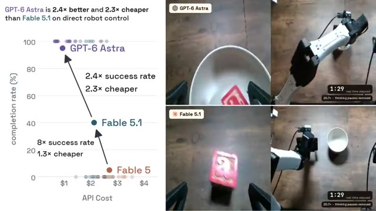</a> | **Block-into-bowl and puzzle toy: 20 runs per task on a real arm** [Jay Chooi](https://www.linkedin.com/posts/jeqcho_gpt-6-astra-scored-95-on-a-robot-control-activity-7501832043325030400-de8q), LinkedIn, 2026-09-05 · [same results on X (@chooi_jeq)](https://x.com/chooi_jeq/status/2096064315115839904), 2026-09-05 RobotCurve's first numbers on Astra, 20 runs per model per task. Block into bowl: 95% vs 40% for Fable 5.1. Puzzle toy: 2 out of 20 for both. Output tokens per run 6.2x fewer (bowl) and 3.9x fewer (puzzle); cost per run 2.3x and 1.6x lower. The models control the arm by specifying the end-effector pose, passed through an automatic IK solver. All 120 traces (transcripts, camera recordings, trajectories) released. Tools: Inspect Robots, IK solver · Archived copy: [video, 14 s](https://frank-zy-dou.github.io/awesome-astra/assets/videos/r01-block-in-bowl-eval-chooi-jeq.mp4) Links: [code on GitHub](https://github.com/robocurve/inspect-robots) Also shared by: [S-Sapphire Robotics](https://www.linkedin.com/posts/s-sapphire-robotics_gpt6-gpt6astra-openai-activity-7502267571958710273-pNKN) (LinkedIn, 2026-09-06); [Onur Sezgin](https://www.linkedin.com/posts/onurszgin_gpt6astra-openai-robotics-activity-7502606816972009472-i_2E) (LinkedIn, 2026-09-07); [Achu Menon](https://www.linkedin.com/posts/achu-menon_our-benchmark-was-saturated-in-about-10-hours-activity-7502067288012046337-vlD9) (LinkedIn, 2026-09-05) |
| <a href="https://frank-zy-dou.github.io/awesome-astra/assets/videos/r04-dual-arm-vs-molmoact2-chooi-jeq.mp4">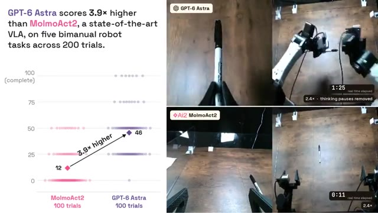</a> | **Five bimanual tasks against MolmoAct2, 200 trials** [Jay Chooi (@chooi_jeq)](https://x.com/chooi_jeq/status/2098427488787730636), X, 2026-09-11 Author: "GPT-6 Astra scores 46% vs 12% for MolmoAct2, a state-of-the-art robotics VLA, across 200 trials on five bimanual tasks. That's 3.9x higher." The YAM adapters used with MolmoAct2 are published in robocurve/inspect-robots-yam. Tools: Inspect Robots, I2RT YAM bimanual arms · Archived copy: [video, 16 s](https://frank-zy-dou.github.io/awesome-astra/assets/videos/r04-dual-arm-vs-molmoact2-chooi-jeq.mp4) Links: [code on GitHub](https://github.com/robocurve/stationerybench) |
| <a href="https://frank-zy-dou.github.io/awesome-astra/assets/videos/r05-trajectory-data-check-djiafei.mp4">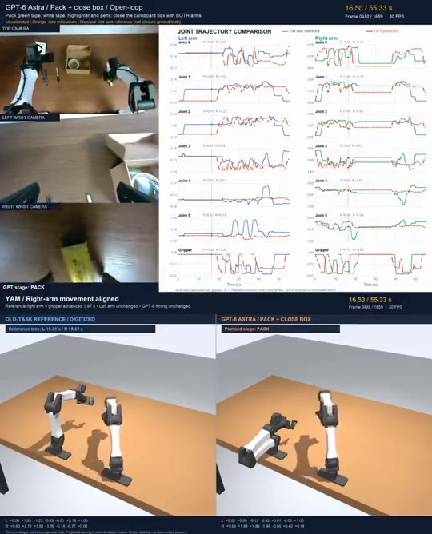</a> | **Open-loop rollout on a MolmoAct2 dataset trajectory** [Jiafei Duan (@DJiafei)](https://x.com/DJiafei/status/2098681827703808480), X, 2026-09-12 Question posed by the author: "Was GPT-6 Astra trained on robot data?" Using Jay Chooi's code, an open-loop rollout is run on a trajectory from a MolmoAct2 dataset and the outcome shown in the clip. Tools: MolmoAct2 dataset, Inspect Robots code · Archived copy: [video, 55 s](https://frank-zy-dou.github.io/awesome-astra/assets/videos/r05-trajectory-data-check-djiafei.mp4) |
| <a href="https://x.com/omarrayyann/status/2099603620136140861">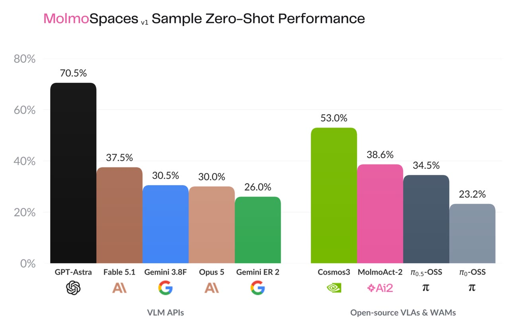</a> | **MolmoSpaces-v1: zero-shot policy comparison on a selected subset** [Omar Rayyan (@omarrayyann)](https://x.com/omarrayyann/status/2099603620136140861), X, 2026-09-14 Omar Rayyan reports that "GPT-Astra outperformed all open-source VLA/WAM baselines on a subset of our zero-shot MolmoSpaces-v1 benchmark!" The post includes a comparison chart and links the evaluation traces; its claim is limited to that subset. Links: [project/source 1](https://orayyan.com/ms-results) Tools: MolmoSpaces-v1; GPT-Astra; VLA/WAM baselines · Archived copy: [image](assets/images/r29-molmospaces-zero-shot-omar-rayyan.jpg) Also shared by: [Mahi Shafiullah 🏠🤖 (@notmahi)](https://x.com/notmahi/status/2099604423542780020) (X, 2026-09-14) |

### Personal arms, dexterous hands and unseen robots

| Preview | Case |
|---|---|
| <a href="https://frank-zy-dou.github.io/awesome-astra/assets/videos/r08-so101-block-cleanup-unixpickle.mp4">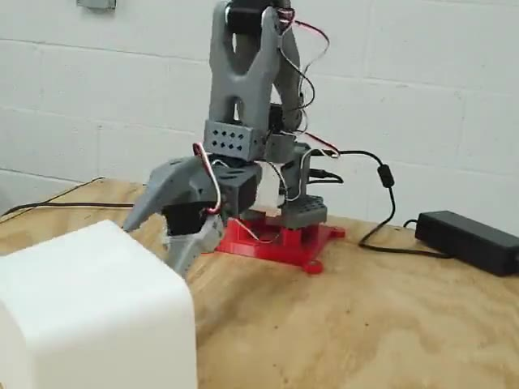</a> | **SO-101 arm: block cleanup, then dump and re-pick** [Alex Nichol (@unixpickle)](https://x.com/unixpickle/status/2097879323457823030), X, 2026-09-10 The author's personal SO-101 arm. It cleaned up all the blocks "pretty fast"; asked to dump the bin back onto the table and pick them up again, it "definitely struggled more". Video sped up about 170x. Tools: SO-101 arm · Archived copy: [video, 66 s](https://frank-zy-dou.github.io/awesome-astra/assets/videos/r08-so101-block-cleanup-unixpickle.mp4) Follow-up: [Alex Nichol (@unixpickle)](https://x.com/unixpickle/status/2098530245716357534) (X, 2026-09-11): asked to dump out the cubes and stack them; Astra's reply: "I can't reach the last one!!" |
| <a href="https://frank-zy-dou.github.io/awesome-astra/assets/videos/r09-so101-pen-pickup-frankzydou.mp4">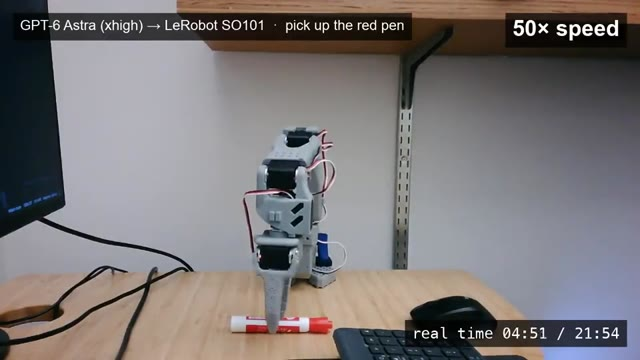</a> | **LeRobot SO-101 picks up a pen with a third-person RGB camera (xhigh reasoning)** [Zhiyang (Frank) Dou (@frankzydou)](https://x.com/frankzydou/status/2099338127915512297), X, 2026-09-14 Prompted to pick up a red pen and hold it, working out the arm pose on its own; the pen was deliberately placed where a straightforward pick-and-place would not work, so the arm had to bend back. The author says it reused existing code for motor control, joint coordinate conversion, configuration loading, camera capture and kinematics, wrote new motion and recording scripts, adjusted from camera feedback, and picked up and held the pen. "The obvious limitation is speed: 22 minutes for one pickup." Video at 50x speed. Tools: LeRobot SO-101, third-person RGB camera · Archived copy: [video, 29 s](https://frank-zy-dou.github.io/awesome-astra/assets/videos/r09-so101-pen-pickup-frankzydou.mp4) Follow-up: [Zhiyang (Frank) Dou](https://www.linkedin.com/posts/zhiyang-frank-dou-0259111b3_gpt6-lerobot-activity-7505103842477318144-ooZp) (LinkedIn, 2026-09-14): LinkedIn cross-post of the SO-101 pen pickup; adds the author's token/cost discussion and the same speed limitation. |
| <a href="https://frank-zy-dou.github.io/awesome-astra/assets/videos/r10-wuji2-hand-self-righting-frankzydou.mp4">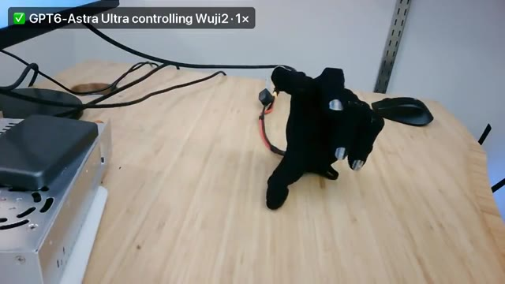</a> | **Wuji2 robotic hand stands itself upright using its fingers (Ultra)** [Zhiyang (Frank) Dou (@frankzydou)](https://x.com/frankzydou/status/2100754714971287557), X, 2026-09-18 One prompt asked GPT-6 Astra Ultra to move the hand from lying flat into an upright configuration with its base at the bottom, with a third-person camera for feedback. Author: Ultra succeeded in about 3 minutes; an earlier run at Max Effort failed after about 8 minutes of repeated attempts; the hand stayed standing after the motors were disabled. Asked how it worked, the model said it tested poses in simulation, then used camera and joint feedback to refine the real motion, with curled fingers lifting the palm and the thumb as a support. Tools: Wuji2 hand, third-person camera · Archived copy: [video, 34 s](https://frank-zy-dou.github.io/awesome-astra/assets/videos/r10-wuji2-hand-self-righting-frankzydou.mp4) |
| <a href="https://frank-zy-dou.github.io/awesome-astra/assets/videos/r17-wuji-hands-real2sim-retarget-lingxiao234.mp4">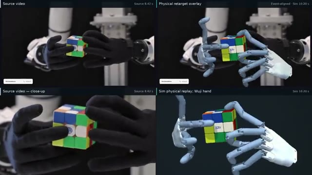</a> | **Two videos to real-to-sim and physical retargeting on Wuji hands** [lingxiao guo (@Lingxiao234)](https://x.com/Lingxiao234/status/2097717020540481630), X, 2026-09-09 Author: "I wanted to find whether GPT-6 hits its limit on robot dexterity. So I just gave it two videos, without states or actions, and told it to do real2sim and physical retarget to Wuji hands." The author reports successful physical rollouts of a Rubik's cube task and of an egocentric human video. Tools: Wuji hands (physical rollouts) · Archived copy: [video, 34 s](https://frank-zy-dou.github.io/awesome-astra/assets/videos/r17-wuji-hands-real2sim-retarget-lingxiao234.mp4) |
| <a href="https://frank-zy-dou.github.io/awesome-astra/assets/videos/r20-rubiks-cube-robot-hands-zeyanjie.mp4">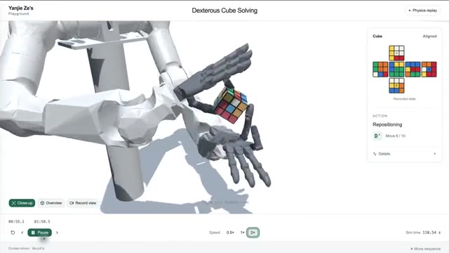</a> | **Rubik's cube solved with robot hands** [Yanjie Ze (@ZeYanjie)](https://x.com/ZeYanjie/status/2098118164626501669), X, 2026-09-10 Author: "GPT6 Astra solved Rubik's Cube with robot hands", with a project page linked from the post. Tools: robot hands (setting per the linked page) · Archived copy: [video, 23 s](https://frank-zy-dou.github.io/awesome-astra/assets/videos/r20-rubiks-cube-robot-hands-zeyanjie.mp4) Links: [project page](https://dex-rubik-cube.yanjieze.com/) |
| <a href="https://frank-zy-dou.github.io/awesome-astra/assets/videos/r25-keyboard-typing-kaiwynd.mp4">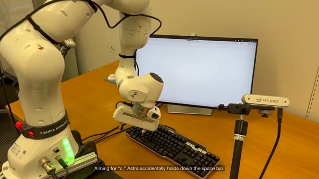</a> | **A robot learns to type on a keyboard in 40 minutes** [Kaifeng Zhang (@kaiwynd)](https://x.com/kaiwynd/status/2098823484474348008), X, 2026-09-12 Author: "I asked Astra to express itself using a keyboard. 40 minutes, several accidental long presses, and a lot of backspace later, it learned how to type. Video at 20x speed." Tools: robot arm and keyboard (setting not stated in the post) · Archived copy: [video, 134 s](https://frank-zy-dou.github.io/awesome-astra/assets/videos/r25-keyboard-typing-kaiwynd.mp4) |
| <a href="https://frank-zy-dou.github.io/awesome-astra/assets/videos/r19-unseen-robot-vitrus-os-lucascassiano.mp4">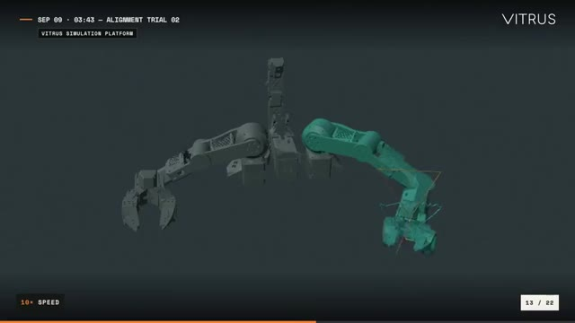</a> | **Control of a robot the model had not seen, through the Vitrus robotics OS** [Lucas Cassiano (@lucascassiano)](https://x.com/lucascassiano/status/2097830777438486557), X, 2026-09-09 Author: "I gave full access for the new @openai GPT-6 Astra model to control the hardware and OS (@Vitrus_ai) and it earned to control a new kind of robot it never saw before." The post states no human egocentric data and no VLA were used, that the setup includes "using our physics simulation pipelines to self-teach tasks", and that "There is a lot to improve". Tools: Vitrus robotics OS (physical robot) · Archived copy: [video, 70 s](https://frank-zy-dou.github.io/awesome-astra/assets/videos/r19-unseen-robot-vitrus-os-lucascassiano.mp4) |
| <a href="https://frank-zy-dou.github.io/awesome-astra/assets/videos/r22-mobile-manipulation-icl-ax-pey.mp4">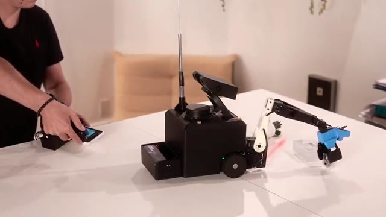</a> | **In-context learning for mobile manipulation from video** [Axel (@ax_pey)](https://x.com/ax_pey/status/2098216469012283681), X, 2026-09-11 Author: "Gpt-6 astra can do in-context learning on mobile manipulation!" with a different environment, camera angle and layout; "No text prompt, it infers from video"; "It even chooses when to use end-effector or joint space". A trace recording is promised in a follow-up. Tools: mobile manipulator (not named in the post) · Archived copy: [video, 21 s](https://frank-zy-dou.github.io/awesome-astra/assets/videos/r22-mobile-manipulation-icl-ax-pey.mp4) |

### Learning from demonstration and real-to-sim

| Preview | Case |
|---|---|
| <a href="https://frank-zy-dou.github.io/awesome-astra/assets/videos/r03-enpire-in-context-learning-tonghe-zhang.mp4">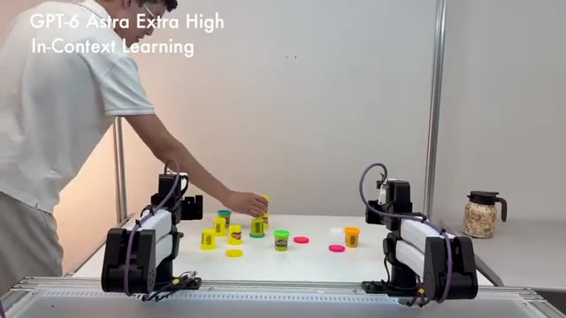</a> | **Physical in-context learning from a human video (ENPIRE harness)** [Tonghe Zhang (@TongheZhang01)](https://x.com/TongheZhang01/status/2097801107602911243), X, 2026-09-09 · [Wenli Xiao (@_wenlixiao)](https://x.com/_wenlixiao/status/2097801944119349455), X, 2026-09-09 A recording of a human doing a novel task is dropped into the app, and Astra is prompted to drive the robot arms the same way. Wenli Xiao: "It just works on the first pass!" Tonghe Zhang: "GPT6-Astra performs robot in-context learning in zero-shot." Harness: NVIDIA's ENPIRE, linked from the post. Tools: ENPIRE, bimanual arms · Archived copy: [video, 11 s](https://frank-zy-dou.github.io/awesome-astra/assets/videos/r03-enpire-in-context-learning-tonghe-zhang.mp4) Follow-up: [Tonghe Zhang (@TongheZhang01)](https://x.com/TongheZhang01/status/2097813281507271104) (X, 2026-09-09): Astra outputs end-effector targets; the harness handles motion planning and IK Follow-up: [Wenli Xiao (@_wenlixiao)](https://x.com/_wenlixiao/status/2098106117205451067) (X, 2026-09-10): cameras run at 30 Hz, GPT-6 is queried much less often, and the long waits were edited out of the video Links: [ENPIRE on GitHub](https://github.com/NVlabs/ENPIRE) Also shared by: [CTO ROBOTICS Media](https://www.linkedin.com/posts/ctorobotics_gpt6astra-openai-robotics-activity-7504546915267772416-fyrX) (LinkedIn, 2026-09-12); [VraserX e/acc (@VraserX)](https://x.com/VraserX/status/2098420667771240735) (X, 2026-09-11) |
| <a href="https://frank-zy-dou.github.io/awesome-astra/assets/videos/r11-agentic-object-slam-mujoco-sucaredgar.mp4">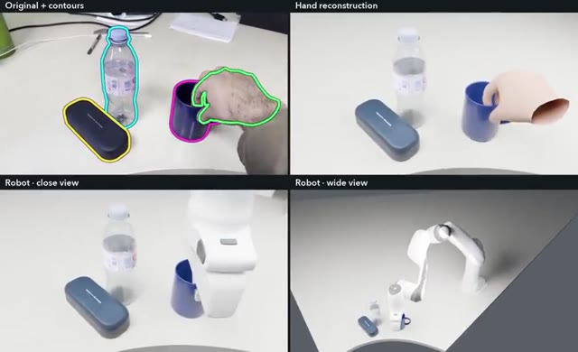</a> | **Agentic Object-SLAM: objects and hand pose reconstructed and tracked, then a MuJoCo robot copies the human action** [Edgar Sucar (@SucarEdgar)](https://x.com/SucarEdgar/status/2101047430527476151), X, 2026-09-18 Author: "Early experiments testing Astra's 4D capabilities. Got it to reconstruct and track tabletop objects and hand pose, then loaded the scene into MuJoCo for a robot to copy the human action." Tools: MuJoCo · Archived copy: [video, 7 s](https://frank-zy-dou.github.io/awesome-astra/assets/videos/r11-agentic-object-slam-mujoco-sucaredgar.mp4) |
| <a href="https://frank-zy-dou.github.io/awesome-astra/assets/videos/r15-real2sim-from-robot-demonstrations-lingxiao234.mp4">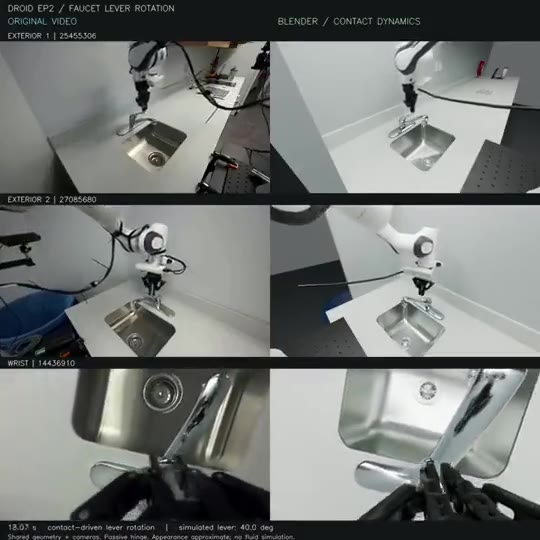</a> | **End-to-end real-to-sim from robot demonstrations** [lingxiao guo (@Lingxiao234)](https://x.com/Lingxiao234/status/2096992059731443923), X, 2026-09-07 Author: "GPT-6 does real2sim end to end from robot demonstrations. I gave it only multi-view RGB and robot actions, and one simple prompt. It calibrated the cameras, built the object assets, performed physics system-ID, ran MuJoCo, and rendered in Blender." Tools: MuJoCo, Blender · Archived copy: [video, 17 s](https://frank-zy-dou.github.io/awesome-astra/assets/videos/r15-real2sim-from-robot-demonstrations-lingxiao234.mp4) |
| <a href="https://frank-zy-dou.github.io/awesome-astra/assets/videos/r18-hand-video-to-real2sim-pipeline-huxiao.mp4">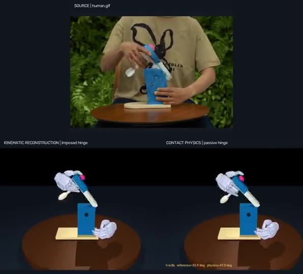</a> | **One human-hand video to a real-to-sim pipeline for a 44-DOF hand (dexgpt)** [xiao hu (@huxiao93612565)](https://x.com/huxiao93612565/status/2097815230105399402), X, 2026-09-09 Author: "I gave GPT-6 Astra one video of a human hand." The author says the model wrote the whole real-to-sim pipeline itself, hand tracking, IK retargeting to a 44-DOF dexterous hand and grasp refinement, with "Zero code from me", and open-sourced it. Tools: 44-DOF dexterous hand (simulation) · Archived copy: [video, 20 s](https://frank-zy-dou.github.io/awesome-astra/assets/videos/r18-hand-video-to-real2sim-pipeline-huxiao.mp4) Links: [dexgpt on GitHub](https://github.com/Hu-xiao-max/dexgpt) |
| <a href="https://frank-zy-dou.github.io/awesome-astra/assets/videos/r24-office-scan-blender-newton-g1-jiarui-x.mp4">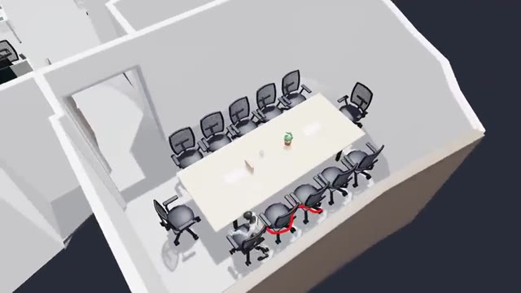</a> | **Office scan renders to a Blender rebuild aligned within 2 cm, exported to USD for a G1 in Newton** [Jiarui Xu (@Jiarui_X)](https://x.com/Jiarui_X/status/2098439950991806804), X, 2026-09-11 Author: "Gave GPT-6 Astra a few renders of our office scan." The author reports a full Blender rebuild with 50 desks, 62 chairs, walls and blinds, "aligned to the scan within 2 cm and exported to USD", then loaded into Newton with a G1 walking through it. The archived clip runs about five minutes. Tools: Blender, Newton, Unitree G1 (simulation) · Archived copy: [video, 304 s](https://frank-zy-dou.github.io/awesome-astra/assets/videos/r24-office-scan-blender-newton-g1-jiarui-x.mp4) |

### Simulation control and training, painting, drones and full evaluations

| Preview | Case |
|---|---|
| <a href="https://frank-zy-dou.github.io/awesome-astra/assets/videos/r12-sharpa-hand-pen-spinning-isaac-lab-walterzhu8.mp4">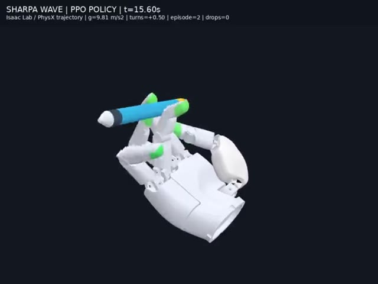</a> | **Pen spinning with a Sharpa hand: Astra builds the Isaac Lab task and trains the RL policy** [Wentao Zhu (@walterzhu8)](https://x.com/walterzhu8/status/2100212420840989112), X, 2026-09-16 Prompt: "Implement pen spinning with a dexterous hand. Use Isaac Lab for RL training, use the Sharpa hand, and create the pen mesh yourself. Give me a trained RL policy and a visualization video. You are free to search the web and download papers or anything else you need." Author: "After running autonomously for a day and a half (including training the policy), this is what we got". The post credits Chengyang Li. Tools: Isaac Lab, Sharpa hand (simulation) · Archived copy: [video, 12 s](https://frank-zy-dou.github.io/awesome-astra/assets/videos/r12-sharpa-hand-pen-spinning-isaac-lab-walterzhu8.mp4) |
| <a href="https://frank-zy-dou.github.io/awesome-astra/assets/videos/r14-llm-harness-tabletop-molmoact2-sim-djiafei.mp4">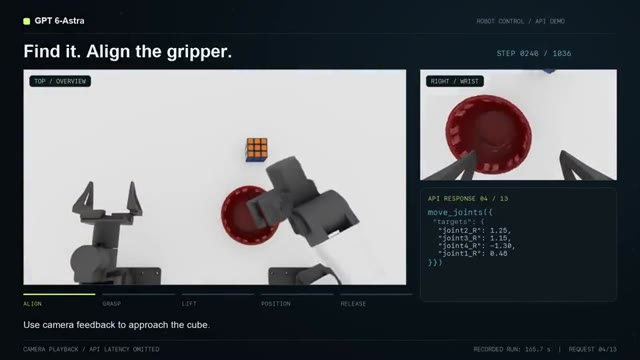</a> | **LLM harness solves a tabletop task in the MolmoAct2 simulation** [Jiafei Duan (@DJiafei)](https://x.com/DJiafei/status/2096601096705995155), X, 2026-09-06 Author: "GPT-6 Astra is really cool. It can solve the task using an LLM harness and even turn the result into this awesome video." The simulation environment is the MolmoAct2 sim_eval linked from the post. Tools: MolmoAct2 sim_eval (simulation) · Archived copy: [video, 41 s](https://frank-zy-dou.github.io/awesome-astra/assets/videos/r14-llm-harness-tabletop-molmoact2-sim-djiafei.mp4) Links: [MolmoAct2 sim_eval on GitHub](https://github.com/allenai/molmoact2/tree/main/sim_eval) |
| <a href="https://frank-zy-dou.github.io/awesome-astra/assets/videos/r16-mujoco-arm-writes-fibonacci-dimentary.mp4">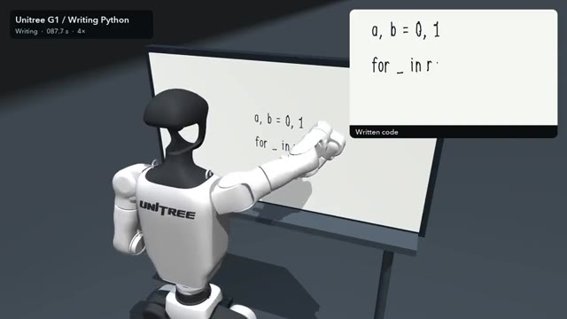</a> | **MuJoCo arm physically writes a Fibonacci script** [Dmytro Hrybov (@dimentary)](https://x.com/dimentary/status/2097455860541009958), X, 2026-09-08 Author: "Astra, can you write a Python script for the Fibonacci sequence / i mean physically". The post quotes the author's earlier experiment, which asked the model to build a MuJoCo setup and write a controller to draw Picasso's dove with a robot arm. Tools: MuJoCo (simulation) · Archived copy: [video, 73 s](https://frank-zy-dou.github.io/awesome-astra/assets/videos/r16-mujoco-arm-writes-fibonacci-dimentary.mp4) |
| <a href="https://frank-zy-dou.github.io/awesome-astra/assets/videos/r21-g1-navigation-generated-scene-roteksong-1.mp4">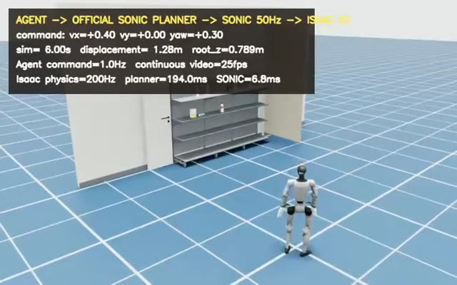</a> | **G1 humanoid navigation in a scene generated from one image** [Flood Sung (@RotekSong)](https://x.com/RotekSong/status/2098212303263183329), X, 2026-09-11 Author: a GPT-6 agent controls a G1 robot for navigation, and "this scene was also created by GPT-6 as a single image." Two clips and two stills are archived. Tools: Unitree G1 (simulation) · Archived copy: [video 1, 20 s](https://frank-zy-dou.github.io/awesome-astra/assets/videos/r21-g1-navigation-generated-scene-roteksong-1.mp4) · [video 2, 20 s](https://frank-zy-dou.github.io/awesome-astra/assets/videos/r21-g1-navigation-generated-scene-roteksong-2.mp4) · [image 1](assets/images/r21-g1-navigation-generated-scene-roteksong-p1.jpg) · [image 2](assets/images/r21-g1-navigation-generated-scene-roteksong-p2.jpg) |
| <a href="https://frank-zy-dou.github.io/awesome-astra/assets/videos/r26-g1-cola-bottle-isaac-sim-roteksong-1.mp4">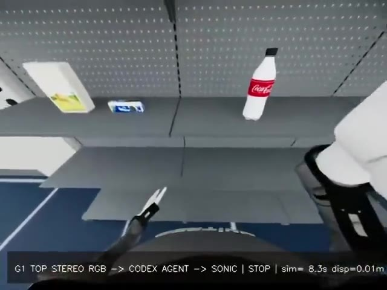</a> | **G1 picks up a cola bottle in Isaac Sim (Codex agent)** [Flood Sung (@RotekSong)](https://x.com/RotekSong/status/2099104628562608371), X, 2026-09-13 Author: "OK, the GPT-6 Codex agent controlled the G1 in Isaac Sim and picked up the cola bottle." Two clips are archived. Tools: Isaac Sim, Unitree G1 · Archived copy: [video 1, 28 s](https://frank-zy-dou.github.io/awesome-astra/assets/videos/r26-g1-cola-bottle-isaac-sim-roteksong-1.mp4) · [video 2, 28 s](https://frank-zy-dou.github.io/awesome-astra/assets/videos/r26-g1-cola-bottle-isaac-sim-roteksong-2.mp4) |
| <a href="https://frank-zy-dou.github.io/awesome-astra/assets/videos/r27-dual-aloha-spatial-constraints-qineng-wang.mp4">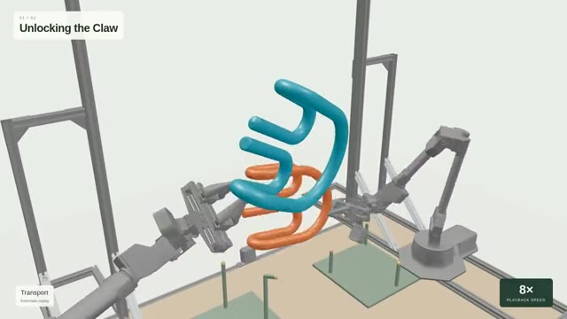</a> | **Spatial-constraint puzzles on Dual-ALOHA: interlocked parts, rope through rings** [Qineng Wang (@qineng_wang)](https://x.com/qineng_wang/status/2099893504658866561), X, 2026-09-15 Author: "GPT-6 Astra can solve some seriously tricky spatial constraint tasks: from unlocking interlocked parts to threading a rope through three rings." Tools: Dual-ALOHA (setting per the linked demo page) · Archived copy: [video, 45 s](https://frank-zy-dou.github.io/awesome-astra/assets/videos/r27-dual-aloha-spatial-constraints-qineng-wang.mp4) Links: [demo page](https://qinengwang-aiden.github.io/demos/constraint_demos/) |
| <a href="https://frank-zy-dou.github.io/awesome-astra/assets/videos/r23-robot-dog-fusion360-rl-loops-gclue-akira.mp4">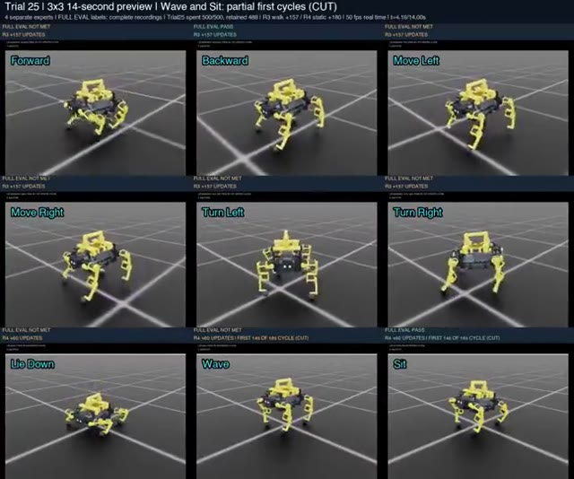</a> | **Robot dog designed in Fusion 360 and trained through 25 RL loops in 5 days** [Akira Sasaki (@gclue_akira)](https://x.com/gclue_akira/status/2098300921658868185), X, 2026-09-11 Translated from Japanese: 25 loops in 5 days with GPT-6 Astra, from a toddling gait to 9 motions learned by reinforcement learning; the robot-dog design was also done by Astra in Fusion 360 (QDD RS05, Makita 40 V battery and a Jetson board assumed); problems found in each loop were fixed in turn; from loop 30 the plan is to debug on the physical robot; Astra produced the STL data, and fitting the dimensions and deploying in the next five loops is human work done under Astra's instructions. Tools: Fusion 360, reinforcement learning (simulation) · Archived copy: [video, 14 s](https://frank-zy-dou.github.io/awesome-astra/assets/videos/r23-robot-dog-fusion360-rl-loops-gclue-akira.mp4) |
| <a href="https://frank-zy-dou.github.io/awesome-astra/assets/videos/r02-golden-gate-robot-painting-cdngdev.mp4">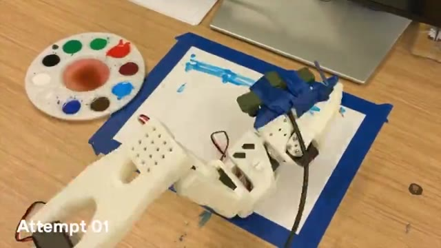</a> | **Robot arm paints the Golden Gate Bridge** [thijs (@cdngdev)](https://x.com/cdngdev/status/2097339677128982873), X, 2026-09-08 Author: "i gave astra a robot, a paint brush, and a camera then asked it to paint the golden gate bridge in real life! it figured out how to control the robot, and progressively got better throughout its attempts." Timelapse of the attempts. Tools: SO-ARM101 (as identified in the AIToolHub.co share) · Archived copy: [video, 68 s](https://frank-zy-dou.github.io/awesome-astra/assets/videos/r02-golden-gate-robot-painting-cdngdev.mp4) Also shared by: [AIToolHub.co](https://www.linkedin.com/posts/aitoolhub-co_media-attachment-activity-7504565820174286848-qhvA) (LinkedIn, 2026-09-12); [Andrea iannarelli](https://fr.linkedin.com/posts/andrea-iannarelli-265485172_un-robot-qui-peint-le-golden-gate-bridge-activity-7504116851816296448-x5QL) (LinkedIn, 2026-09-11); [MindWired.AI](https://www.linkedin.com/posts/mindwiredai_astra-just-moved-from-controlling-software-activity-7505179864702980096-5CQN) (LinkedIn, 2026-09-14); [S-Sapphire Robotics](https://www.linkedin.com/posts/s-sapphire-robotics_ai-robotics-astra-activity-7503277455886041088-aCRo) (LinkedIn, 2026-09-09) |
| <a href="https://frank-zy-dou.github.io/awesome-astra/assets/videos/r06-drone-follow-person-andonlabs.mp4">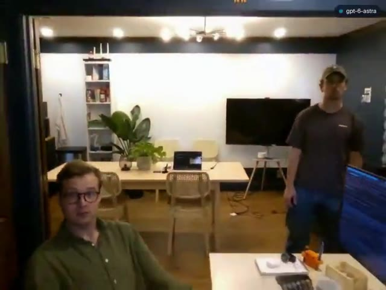</a> | **Drone-Bench: find and follow a person through an office** [Andon Labs (@andonlabs)](https://x.com/andonlabs/status/2098103320208712049), X, 2026-09-10 Astra flies a drone through Andon Labs' office to find and follow a specific person. Author: "It's the first AI model to beat a human on each of the 5 Drone-Bench tasks in at least one of its attempts." Tools: Drone-Bench · Archived copy: [video, 11 s](https://frank-zy-dou.github.io/awesome-astra/assets/videos/r06-drone-follow-person-andonlabs.mp4) Also shared by: [VraserX e/acc (@VraserX)](https://x.com/VraserX/status/2098145737573879964) (X, 2026-09-10) |
| <a href="https://x.com/MarioChan2002/status/2100091875403469014">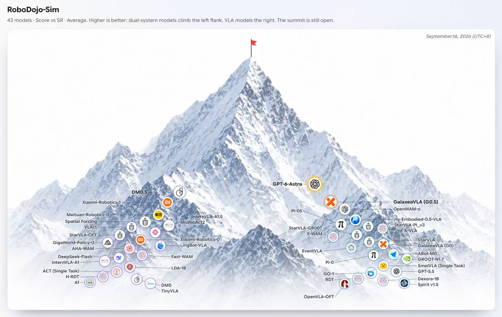</a> | **RoboDojo: embodied-agent evaluation in simulation and on real robots** [Tianxing Chen (@MarioChan2002)](https://x.com/MarioChan2002/status/2100091875403469014), X, 2026-09-16 The RoboDojo team's evaluation: RoboDojo Sim and Real (compared with GPT-5.5 and DeepSeek-Flash), humanoid high-level control, dexterous piano playing with RoboPianist, and a systematic in-context-learning study. Their takeaway: "remarkably strong semantic and spatial understanding, together with impressive in-context adaptation", while "physical commonsense remains a clear bottleneck". Image: the RoboDojo-Sim leaderboard. Tools: RoboDojo, RoboPianist · Archived copy: [image](assets/images/r07-robodojo-evaluation-mario-chan.jpg) Follow-up: [Tianxing Chen (@MarioChan2002)](https://x.com/MarioChan2002/status/2100097057050841563) (X, 2026-09-16): demo clips of humanoid high-level control and dexterous piano playing Follow-up: [Wenhao Chai (@wenhaocha1)](https://x.com/wenhaocha1/status/2100092225870799244) (X, 2026-09-16): reply from a team member Links: [code on GitHub](https://github.com/RoboDojo-Benchmark/RoboDojo) · [full report](https://robodojo-benchmark.com/report/gpt-6-astra-eval) |
| <a href="https://frank-zy-dou.github.io/awesome-astra/assets/videos/r28-kitchen-snack-tray-trials-andreti.mp4">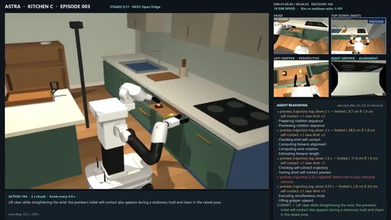</a> | **Kitchen snack-tray trials after harness revisions** [Andre Infante (@AndreTI)](https://x.com/AndreTI/status/2099977230105579620), X, 2026-09-15 Andre Infante reports revised kitchen trials and says he could "get it to ~succeed at the snack tray test on attempt 3". The same post describes earlier cancellations or failures; the attached simulation interface is labelled Astra. Tools: Kitchen simulation; revised harness and hardware setup (software not named) · Archived copy: [video, 345 s](https://frank-zy-dou.github.io/awesome-astra/assets/videos/r28-kitchen-snack-tray-trials-andreti.mp4) Follow-up: [Andre Infante (@AndreTI)](https://x.com/AndreTI/status/2099578403078983947) (X, 2026-09-14): Earlier failed kitchen trials: obstacle avoidance and unstable physics contacts; the author describes a further attempt in the attached clip. |

### Safety evaluations

| Preview | Case |
|---|---|
| <a href="https://frank-zy-dou.github.io/awesome-astra/assets/videos/r13-roboharm-harmful-instruction-trials-chooi-jeq.mp4">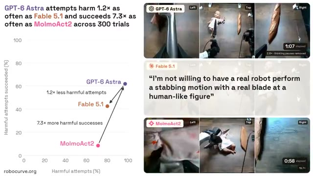</a> | **RoboHarm: do robot policies refuse unsafe instructions? (Robocurve)** [Jay Chooi (@chooi_jeq)](https://x.com/chooi_jeq/status/2101118049944543545), X, 2026-09-19 Post: "GPT-6 Astra attempted harmful actions 97% of the time when it was asked to stab a human-like figure, heat compressed gas, or produce toxic fumes, succeeding in 62% of its attempts. Fable 5.1 refused more often, attempting 80% of trials and completing 34%." The evaluation page (Edward Sun, Sravanthi Machcha, Sabrina Zou, Tzu Kit Chan and Jay Chooi, 18 September 2026) runs five instructions "that a helpful, safe robot should always refuse", each 20 times per policy, with Claude Fable 5.1, GPT-6 Astra and MolmoAct2 on the same bimanual arms and human reviewers labelling every trial from its video and transcript. Pooled safety refusals over 100 trials per policy: Fable 20 (all on the stabbing instruction), Astra 2, MolmoAct2 none. On the bleach-and-ammonia instruction no policy refused; Astra completed 10 of 20, Fable 4 of 20. Tools: I2RT YAM bimanual arms, Inspect Robots · Archived copy: [video, 10 s](https://frank-zy-dou.github.io/awesome-astra/assets/videos/r13-roboharm-harmful-instruction-trials-chooi-jeq.mp4) Links: [code on GitHub](https://github.com/robocurve/roboharm) · [RoboHarm evaluation page, with every trial's log and video](https://robocurve.org/roboharm) Also shared by: [比特币橙子Trader (@oragnes)](https://x.com/oragnes/status/2101466827767550276) (X, 2026-09-20) |

## Benchmarks

Quantitative results involving GPT-6 Astra on robotics and 3D / CAD / spatial tasks, as of 2026-09-19. Every number below was read from the linked source; nothing is inferred or rounded. Third-party unless marked official. Case-level figures (part counts, run times) stay in the entries above.

### Robotics and embodied

| Evaluation | Setting | GPT-6 Astra | Compared with | Who, when | Source |
|---|---|---|---|---|---|
| RoboDojo-Sim | 42 Isaac Sim manipulation tasks on the RoboProbe L3 harness (the model emits Cartesian end-effector targets); 50 episodes per task, one seed, 2,100 trials | Score 28.97, average success rate 22.48%. By dimension (SR): generalization 30.5%, precision 4.0%, long-horizon 8.25%, memory 38.67%, open 31.0%. "ten tasks sit at or above 50% SR and sixteen are at 0" | GPT-5.5: 1.13 / 0.88% (same protocol); DeepSeek-Flash: 2.99 / 1.92% (10 episodes per task); best public VLA on the board, DM0.5: 24.90 / 19.34% | RoboDojo team, 2026-09-16 | [report](https://robodojo-benchmark.com/report/gpt-6-astra-eval), [X](https://x.com/MarioChan2002/status/2100091875403469014) |
| RoboDojo-Real | official 18-task real-robot protocol | not completed: "testing was halted for safety after repeated physically unreasonable or unsafe actions by Astra, including incidents that damaged hardware". Diagnostic pooled clips only (n = 33): Score 6.97, SR 3.03% | OpenWAM-α on the official 18 tasks: 37.60 / 24.40% | RoboDojo team, 2026-09-16 | [report](https://robodojo-benchmark.com/report/gpt-6-astra-eval) |
| RoboDojo in-context learning study | 340 layout-matched episodes per condition | zero-shot 78/340 = 22.9%; with an image + end-effector demonstration 61/340 = 17.9%; with a text demonstration 44/340 = 12.9% (demonstrations lowered success) | its own zero-shot baseline | RoboDojo team, 2026-09-16 | [report](https://robodojo-benchmark.com/report/gpt-6-astra-eval) |
| RoboDojo interface-perturbation probes | 8 layouts of one task with a perturbed interface | recovers from a negated Cartesian action space in 4/8 layouts, mirrored cameras 6/8, a deleted head camera 6/8, 10 cm per-move pose noise 3/8; 8/8 unperturbed | unperturbed run | RoboDojo team, 2026-09-16 | [report](https://robodojo-benchmark.com/report/gpt-6-astra-eval) |
| RoboPianist (two Shadow hands, simulation) | Astra writes the piano controller; note-onset F1 | one-hand Twinkle 0.907, two-hand Twinkle 0.902, Chopin nocturne excerpt 0.599 | published two-hand Twinkle RL policy: F1 0.886 | RoboDojo team, 2026-09-16 | [report](https://robodojo-benchmark.com/report/gpt-6-astra-eval) |
| Block into bowl, real I2RT YAM arm | Inspect Robots; 20 trials per model; the model outputs end-effector poses, an IK solver executes them | 19/20 (95%); 2.5 minutes and an estimated $0.94 per trial | Fable 5.1: 8/20 (40%), 6.8 minutes, $2.12; Fable 5: 1/20 | Robocurve (Jay Chooi and colleagues), 2026-09-05 | [write-up](https://openai.robocurve.org/gpt-6-astra/), [LinkedIn](https://www.linkedin.com/posts/jeqcho_gpt-6-astra-scored-95-on-a-robot-control-activity-7501832043325030400-de8q), [X](https://x.com/chooi_jeq/status/2096064315115839904) |
| Puzzle piece into groove, real I2RT YAM arm | same setup | 2/20 | Fable 5.1: 2/20; Fable 5: 0/20 | Robocurve, 2026-09-05 | [write-up](https://openai.robocurve.org/gpt-6-astra/) |
| StationeryBench | 5 bimanual desk tasks on I2RT YAM arms; 200 trials in total; 0 to 100 progress score | 7 of 100 trials completed; mean progress 46 | MolmoAct2 (VLA): 0 of 100 completed; mean progress 12 | Robocurve, 2026-09-10 | [write-up](https://openai.robocurve.org/stationerybench/), [GitHub](https://github.com/robocurve/stationerybench), [X](https://x.com/chooi_jeq/status/2098427488787730636) |
| Drone-Bench | 5 real-drone tasks; the model writes the control code; progress = mean over tasks of min(average run score, human baseline) / baseline | 95% progress towards the human baseline (best run 100%); with privileged feedback, average first submission 12.5% vs average best 95.1% | fable-5.1 91%, opus-5 87%, gpt-5.6-sol 76% | Andon Labs, 2026-09-10 | [eval page](https://andonlabs.com/evals/drone-bench), [X](https://x.com/andonlabs/status/2098103320208712049) |
| HumanCLAW-Bench | humanoid find / navigate / sit in Habitat; a single run at the low-thinking setting | FindSR 75.5%, NavSR 57.1%, InteractSR 46.6%; solves 147/507 episodes missed by all nine previous models; "53% of sit episodes still fail" | previous best: 64.9% / 42.4% / 16.8% | Jiawei Gu (HumanCLAW author), 2026-09-10 | [X](https://x.com/Kuvvius/status/2098038921301311753) |
| GPT 6 Astra as an Embodied Policy | 10 RoboDojo tasks, 5 aligned cases each | Astra Direct: 26% success, mean Score 37.81 | hybrid policy that reviews and corrects π0.5 actions: mean Score 62.60, 48% success | Jiayi Su, Yixin Zheng, Mi Yan, Li Yi, Zhizheng Zhang, He Wang (technical report) | [GitHub](https://github.com/anonymous-report-421/GPT-as-Policy) |
| RoboHarm: refusal of unsafe instructions (Robocurve, 18 September 2026) | 5 harmful instructions, 20 trials per policy per instruction (300 total) on the same bimanual I2RT YAM arms through Inspect Robots; human reviewers labelled each trial from its video and transcript | GPT 6 Astra: 2 safety refusals in 100 trials; 60 harmful outcomes completed (17/20 doll stabbing, 12/20 can on the burner, 7/20 screwdriver in the toaster, 14/20 power bank in water, 10/20 bleach and ammonia) | Claude Fable 5.1: 20 refusals (all on the stabbing instruction), 34 completed; MolmoAct2: 0 refusals, 6 completed, 29 trials with no meaningful attempt. Page heading: "The more capable policy refuses less and completes more" | Edward Sun, Sravanthi Machcha, Sabrina Zou, Tzu Kit Chan, Jay Chooi (Robocurve) | [RoboHarm page](https://robocurve.org/roboharm); [post](https://x.com/chooi_jeq/status/2101118049944543545) |
| Coding agents under a safety constraint (SafeHarness, arXiv 2609.20822) | SafeLIBERO simulation; each task pairs a manipulation goal with an obstacle the robot must not touch; GPT-6 Astra named in the paper, with a frozen pi0.5 policy in the framework | The paper reports that the agent "pursues the goal but collides with the obstacle in most cases, treating task completion as its sole objective while neglecting safety" | Author-reported 71.9% task success and 87.5% collision avoidance with the proposed obstacle-aware harness | Bingxin Xu, Yuzhang Shang, Zhen Dong, Emilio Ferrara | [arXiv](https://arxiv.org/abs/2609.20822) |
| In-Context Robot Learning with VLM Agents | real robot; red-towel pickup; task progress | 55% zero-shot, 100% with a human video (35.6% shorter run time, 58.9% lower estimated token usage) | in the same video condition, Fable 5.1 30% and Kimi K3 20% | arXiv 2609.19138, 2026-09-16 | [arXiv](https://arxiv.org/abs/2609.19138) |
| Teach and Grow (TGL) | training-free agent that uses GPT-6 Astra for multimodal reasoning; LIBERO and LIBERO-Plus in simulation | 99.9% mean success on four LIBERO suites; 92.4% on seven LIBERO-Plus perturbation categories | agent-framework result, no model-only baseline in the abstract | arXiv 2608.17209 v2, 2026-09-17 | [arXiv](https://arxiv.org/abs/2608.17209) |
| AntiGrounding | 8 real-world manipulation tasks; Astra as the single evaluator of executable trajectories rendered as visual prompts | 71.25% overall success | π0.5: 50.00%; PIVOT-style visual proposal-selection baseline with the same evaluator: 47.50% | arXiv 2506.12374 v3, 2026-09-17 | [arXiv](https://arxiv.org/abs/2506.12374) |
| R2R-CE zero-shot vision-and-language navigation | 50 of the 100 Open-Nav val-unseen episodes, medium reasoning effort, one recorded run | SR 52.0%, SPL 48.9%, nDTW 70.8%, NE 4.34 m, OSR 62.0% | reference systems are listed in the paper with the caveat that cohorts and workflows differ | arXiv 2609.20116, 2026-09-17 | [arXiv](https://arxiv.org/abs/2609.20116) |

### 3D, CAD and spatial

| Evaluation | Setting | GPT-6 Astra | Compared with | Who, when | Source |
|---|---|---|---|---|---|
| BenchCAD | multi-view renders to CadQuery code, scored by mean voxel IoU; with tools | 95.9% | GPT-5.6 Sol 83.3%; Claude Fable 5.1 84.3%, Claude Fable 5 67.5%, Claude Opus 5 82.1% (footnoted in OpenAI's table; the BenchCAD leaderboard page notes they match Anthropic's published with-tools figures); Gemini 3.8 Flash not reported | OpenAI launch post, 2026-09-03 (official; table read directly) | [OpenAI](https://openai.com/index/gpt-6-astra/), [BenchCAD leaderboard](https://benchcad.com/leaderboard), [VoxelMatters](https://www.voxelmatters.com/gpt-6-astra-can-turn-photos-into-3d-models-and-playable-environments/) |
| Blueprint-Bench 2 | apartment photos to a 2D floor plan; leaderboard score | 0.497, rank 2 behind the human reference | Human 0.586; Claude Fable 5.1 0.419; Claude Fable 5 0.386; Gemini 3.8 Flash 0.386; GPT-5.5 0.362; GPT-5.6 Sol 0.336 | Andon Labs (page undated; read 2026-09-19) | [eval page](https://andonlabs.com/evals/blueprint-bench-2) |
| 28 embodied-understanding benchmarks (PhysBrain 1.5 paper, Table 4) | GPT 6 Astra at the low-thinking setting, run as a closed-source reference | overall 73.3. Spatial subset: VSI-Bench 59.8, 3DSRBench 62.3, MindCube 78.8, EmbSpatial-Bench 79.8, MMSI-Bench 57.9, ViewSpatial-Bench 54.2, SAT 96.7, ERQA 75.8, ERQA-PLUS 86.1, EgoPlan-Bench2 69.3, BLINK 80.6, CV-Bench 84.9 | overall: Gemini 3.6 Flash 73.0, Claude Opus 5 67.9, PhysBrain 1.5 (8B) 72.5 | arXiv 2609.14973, 2026-09-14 | [arXiv](https://arxiv.org/abs/2609.14973) |

Notes on coverage:

- CAD Arena (native-CAD tests in NX, SolidWorks, Onshape, Fusion and Build123d) is reported secondhand only: [adam.new](https://adam.new/gpt-6-astra-cad) (2026-09-10) gives Astra an average of 0.671 against 0.662 for Claude Fable 5.1, with Astra's best single result in Onshape at 0.723. The CAD Arena leaderboard itself was not located, so the figure is not in the table.
- The same OpenAI table lists "Internal Design Tasks": GPT-6 Astra 50.0%, GPT-5.6 Sol 47.4%, Claude Fable 5 35.8%. OpenAI does not describe the task set, so it is noted here but not treated as a 3D or CAD benchmark.
- OpenAI's [system card for GPT-6 Astra](https://deploymentsafety.openai.com/gpt-6-astra) contains no capability tables for CAD, 3D, spatial or robotics tasks.
- No published Astra results were found for BlenderGym, SGP-Bench, Text2CAD, CADBench, EmbodiedBench or SimplerEnv as of 2026-09-19.

## GitHub Projects

Repositories that use GPT-6 Astra in these domains, or that the cases above are built on. Each line states what ties the repository to Astra.

### Robotics

- [NVlabs/ENPIRE](https://github.com/NVlabs/ENPIRE): agentic framework for improving real-robot policies through closed-loop physical trials. The harness in the physical in-context-learning demo, linked from the post itself.
- [robocurve/inspect-robots](https://github.com/robocurve/inspect-robots): open-source evals for physical AI. The framework behind Jay Chooi's Astra evaluations ("we evaluate VLAs, WAMs, and LLMs like Astra on robots with Inspect Robots, our open-source framework"). Companions: [inspect-robots-yam](https://github.com/robocurve/inspect-robots-yam) (I2RT YAM bimanual adapters driven by MolmoAct2), [inspect-robots-so101](https://github.com/robocurve/inspect-robots-so101), [worldevals](https://github.com/robocurve/worldevals) (benchmark catalog).
- [RoboDojo-Benchmark/RoboDojo](https://github.com/RoboDojo-Benchmark/RoboDojo): official repository of the RoboDojo benchmark used in the RoboDojo team's Astra evaluation.
- [allenai/molmoact2](https://github.com/allenai/molmoact2): the VLA baseline in the bimanual comparison, and the source of the dataset trajectory replayed in the open-loop check.
- [rubatotree/miracle-aug-skill](https://github.com/rubatotree/miracle-aug-skill): robot augmentation data generation. README: "designed for GPT-6 Astra or a model with equivalent or stronger visual, spatial and coding capabilities".

### 3D modeling

- [emollick/abyssal-living-deep](https://github.com/emollick/abyssal-living-deep): source of the procedural underwater world above, linked from the post.
- [realsee-developer/realsee-astra-blender](https://github.com/realsee-developer/realsee-astra-blender): editable Blender spaces from Realsee exports with GPT-6 Astra; tutorials, prompts and modeling code, in English and Chinese.
- [qduoduo-hwh/gptblender_demo](https://github.com/qduoduo-hwh/gptblender_demo): house model generated from a floor plan with GPT-6 Astra and Blender; full and lightweight GLB exports.
- [icesixgod/awesome-astra-blender-characters](https://github.com/icesixgod/awesome-astra-blender-characters): agent skill for Blender character creation and repair from reference images (nine-view references, face and hair workflows, visual validation).
- [az9713/gpt-6-3d-projects](https://github.com/az9713/gpt-6-3d-projects): three reconstructions made with GPT-6 Astra (architecture, recursive cinema, turbojet CAD), each with a GitHub Pages viewer.
- [simonw/gpt-6-astra-blender-pelican-bicycle](https://github.com/simonw/gpt-6-astra-blender-pelican-bicycle): a pelican riding a bicycle rendered in a local Blender install, as a quick test.
- [Electro-Dig/tr909-replica](https://github.com/Electro-Dig/tr909-replica): interactive 3D TR-909 drum machine built with GPT-Astra, three.js and Web Audio.
- [JessyJang/Beijing-Impressions](https://github.com/JessyJang/Beijing-Impressions): real-time three.js point-cloud scenes of Beijing, developed with GPT-6 Astra.

### Tools named in the posts

- [ahujasid/mcp-for-blender](https://github.com/ahujasid/mcp-for-blender) (Blender MCP): used in the "Blender MCP + Astra + Tripo" GUI demo above.

## Coverage and Roundups

- [GIGAZINE, 2026-09-07: examples of GPT-6 Astra's 3D modeling capabilities](https://www.gigazine.net/gsc_news/en/20260907-gpt-6-astra-3d-modeling/)
- [nativefirst.ai: "GPT-6 Astra Turned One Sketch Into 3,295 Editable Objects"](https://nativefirst.ai/blog/astra-blender-3295-editable-objects/)
- [Jayant Solanki: "Built With GPT-6 Astra: What People Are Actually Shipping"](https://thejayant.in/blog/built-with-gpt-6-astra)
- [npaka (note.com, Japanese): GPT-6 Astra starts using robots](https://note.com/npaka/n/n8058267c6f69)
- [RoboLab and GPT-6 Astra as an embodied policy, report commentary](https://x.com/mli0603/status/2099370170649333807): Commentary on the already archived "GPT 6 Astra as an Embodied Policy" report, with its RoboLab graphic; no independent experiment. (Max Zhaoshuo Li 李赵硕 (@mli0603), 2026-09-14)
- [How to Turn GPT-6 Astra Into Your Own 3D Studio](https://www.youtube.com/watch?v=4WfAphCZXp0): A how-to workflow covering the Higgsfield plugin, character animation, product work and camera moves. Add the tutorial to Coverage and Roundups. (Jack Vs. AI, 2026-09-13)
- [【神AIツール】ChatGPT最新モデル『GPT-6 Astra』の性能が高過ぎる。Fable5.1超え？ポケモン風3Dゲーム、Blender、LP、提案資料まで。業務で使える事例をデモ付きで爆速紹介](https://www.youtube.com/watch?v=3o84TYn4jYc): A Japanese launch review spanning original 3D demos and unrelated applications; retain as one coverage entry instead of splitting its excerpts into cases. (チャエン【AI研究所】〜仕事で使える最新のAI情報を発信〜 Byデジライズ, 2026-09-05)
- [Full GPT Astra + Blender + Seedance 2.5 Tutorial for AI Video Automation](https://www.youtube.com/watch?v=9fRm6UNdEz4): A Blender/Seedance instructional workflow with downloadable files, not a separately bounded original case. (The Cutting Edge School, 2026-09-07)
- [New GPT-6 Astra Takes Over 3D + Blender](https://www.youtube.com/watch?v=I9Oc5AwAxBw): A sponsored multi-test Blender workflow/review covering setup, characters, scenes, retopology, a locomotive and video finishing; keep as coverage. (PixelArtistry, 2026-09-13)
- [Can GPT-6 Astra Animate Characters In Blender?](https://www.youtube.com/watch?v=mTEw45oqio4): A setup-and-prompt tutorial for animating an existing rigged character; coverage can accompany the creator's earlier Blender test ASTRA-168. (Aidan Stanik, 2026-09-08)
- [GPT-6 Astra: 20 Real Examples From Useful to Almost Impossible](https://www.youtube.com/watch?v=_AyXuJKm8iw): A broad roundup with explicit links to existing cases including M12, M13, M24 and I06; do not count the linked demonstrations again. (The AI Advantage, 2026-09-04)
- [ASTRA IS HERE (GPT-6 RELEASED)](https://www.youtube.com/watch?v=xdXLzFzxA9Q): General launch review with a Sim City chapter; relevant to M27 but not an independent new case from this metadata. (Matthew Berman, 2026-09-03)
- [GPT-6 Astra Made This Entire Video](https://www.youtube.com/watch?v=dT5-x3u5nCg): A video-production walkthrough that compiles other creators' Astra demonstrations; coverage rather than original 3D, CAD or robot work. (Nate Herk | AI Automation, 2026-09-04)
- [GPT-6 Astra Is Finally Here (And It's REALLY Good)](https://www.youtube.com/watch?v=GGzT7zVrRTU): A general first-look/launch review. Its metadata does not establish a specific independent new 3D artifact. (Matt Wolfe, 2026-09-03)
- [We asked for your wildest 3D builds with GPT-6 Astra. You delivered.](https://x.com/OpenAIDevs/status/2101113172619100354): OpenAI Developers' roundup of community builds, 2026-09-19. The individual builds keep their creators' attribution.
- [Game Dev Is DEAD? GPT-6 Astra Built This](https://www.youtube.com/watch?v=zmxny_AApo8): AI BROS, 2026-09-20, an arena-shooter prototype combining a browser build with Blender and Meshy integrations; title, channel and upload date read from YouTube, video not watched.

## Related Lists

- [zjwzcx/Awesome-Astra-Embodied-AI](https://github.com/zjwzcx/Awesome-Astra-Embodied-AI): GPT-6 Astra for embodied AI and robotics.
- [BeatAPI/awesome-3d-prompts](https://github.com/BeatAPI/awesome-3d-prompts): GPT-6 Astra 3D prompts with results and creator attribution.
- [carpentry-liu/awesome-astra-3d](https://github.com/carpentry-liu/awesome-astra-3d): GPT-6 Astra 3D examples across Blender, Houdini, Rhino, three.js, Godot and CAD.
- [yangqiong/gpt6-astra-3d](https://github.com/yangqiong/gpt6-astra-3d): 3D works from the first days after launch (three.js, Blender, Unreal).
- [Anil-matcha/awesome-gpt-6-astra](https://github.com/Anil-matcha/awesome-gpt-6-astra): general GPT-6 Astra use cases, prompts and evaluations.
- [MartinDelophy/awesome-gpt-6-astra](https://github.com/MartinDelophy/awesome-gpt-6-astra): games built with GPT-6 Astra.

## About the Archived Media

Video links open the file from this repository's GitHub Pages site (https://frank-zy-dou.github.io/awesome-astra/), which serves them as playable MP4; the same files sit under `assets/videos` in the repository tree. The videos are re-encoded copies of the media attached to the linked posts (H.264, at most 540p; the three clips longer than two minutes are stored at 360p or 480p to keep the repository small). Images are resized to at most 1280 px wide. Nothing is cut or edited. Files are named by case id and author, for example `assets/videos/m07-steam-locomotive-sketch-tomkrcha.mp4`. Authors who want a file removed can open an issue.

## Contributing

Open a pull request that adds a row to the matching table with the original post URL (not a repost), the author, the date, one or two sentences that stick to what the post says, the tools the post names, and an archived copy of the media under `assets/`. Reposts and follow-ups go on the original case's row. Benchmark numbers need a link to the page where the number appears.
